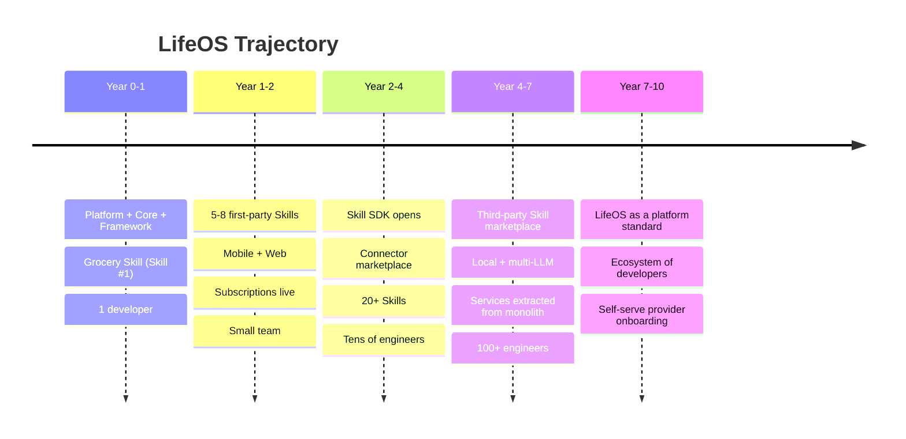
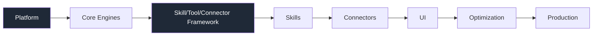

# 01 — LifeOS Vision

> **Read this first.** Everything technical in this manual is downstream of this document. When an engineering decision is ambiguous, resolve it in favor of the principles here.

Related: [00 Index](00_MASTER_INDEX.md) · [02 Architecture](02_LifeOS_Platform_Architecture.md) · [04 Product Spec](04_LifeOS_Product_Specification.md) · [14 Glossary](14_GLOSSARY.md)

---

## 1. What LifeOS is

**LifeOS is an AI-first Personal Operating System** — a single, conversational surface through which a person runs the operational side of their life. Instead of installing 40 disconnected apps, a user talks to LifeOS, and LifeOS coordinates **Skills** (Grocery, Fitness, Diet, Calendar, Travel, Finance, Medicines, Pets, Documents, Vehicles, Smart Home, and more) on their behalf, using **memory** of who they are and **context** about their current situation.

The user experience is: *"I told it once; it remembers; it acts."*

- "We're out of coffee and milk." → Grocery Skill drafts a cart from the cheapest available provider and asks to confirm.
- "Book me a strength session Tuesday morning, but not before my standup." → Fitness + Calendar Skills cooperate.
- "Refill my BP medicine before I run out." → Medicines Skill tracks supply and reorders.

One assistant. Many Skills. Shared memory. Shared context.

## 2. What LifeOS is NOT

- ❌ **Not a grocery app.** Grocery is the *first* Skill, chosen because it is concrete and exercises every platform subsystem (conversation, planning, tools, connectors to providers, memory, notifications, widgets, subscriptions). It is a **proof of the platform**, not the product.
- ❌ **Not a chatbot wrapper.** The LLM does not contain business logic. It understands, plans, and summarizes; **Skills** do the work (see [ADR-0004](adr/adr-0004-ai-no-business-logic.md)).
- ❌ **Not a feature checklist.** We do not ship "features." We ship **Skills** — self-contained capability plugins.
- ❌ **Not a monolithic product.** It is a **platform** that hosts an unbounded set of Skills, eventually from third parties.

> **The single most important architectural consequence:** *Never optimize for the Grocery Skill. Always optimize for the LifeOS Platform.* If a choice makes Grocery slightly easier but makes the 50th Skill harder, it is the wrong choice.

## 3. The 10-year north star

In ten years, LifeOS should be to "running your life" what an app store is to mobile software: a **platform with an ecosystem**, where most value is created by Skills and Connectors that the core team did not write.

To get there, the **foundation must be right on day one.** A platform cannot be retrofitted onto a product. That is why we build **platform-first** (see [05 Roadmap](05_IMPLEMENTATION_ROADMAP.md)).

## 4. The 13 product principles

These are the constitution. Each has a concrete enforcement mechanism (cross-referenced).

1. **AI First** — The default way to do anything is to ask. The Conversation Orchestrator is the primary entry point; traditional UI is a secondary, optional surface. *(02 §Request Lifecycle)*
2. **Conversation First** — State and intent flow through conversation. UI renders conversation outcomes; it does not replace them. *(04)*
3. **Skills over Features** — Capability is packaged as Skills, never as ad-hoc features bolted onto a core. No business logic exists outside a Skill. *(02 §Skill System)*
4. **Platform over Product** — We invest in the platform first and treat every product surface as a consumer of platform contracts. *(05)*
5. **Plugin Architecture** — Skills, Tools, and Connectors are plugins registered at runtime via manifests. The core does not import them directly. *(ADR-0001, 02 §Registries)*
6. **Everything is Context** — Skills act on a **Unified Context** assembled by the platform (database + memory + conversation + settings + permissions), not on raw database reads. *(ADR-0007)*
7. **Memory Driven** — LifeOS remembers facts, preferences, and summaries across time and uses them to personalize. Forgetting is a feature (expiry/scoring), not a bug. *(ADR-0009, 02 §Memory)*
8. **Event Driven** — Side effects propagate as events. Skills react to events; they do not call each other directly. *(ADR-0008)*
9. **Capability Based Permissions** — Access is governed by **capabilities**, not by subscription tiers or Skill identity. Subscriptions grant capabilities; capabilities grant permissions; permissions gate tools. *(ADR-0006)*
10. **Configuration over Hardcoding** — Behavior is driven by configuration and manifests. Magic values, hardcoded provider names, and inline business rules are defects. *(03 §Config)*
11. **Developer Experience First** — A new Skill should be buildable in days, not months. Templates, SDKs, and the Dev Console exist to make the right thing the easy thing. *(03, templates/)*
12. **Scalable by Default** — Architecture assumes growth: from 1 to 100+ engineers, from 1 to 1000+ Skills, from one box to many services. We pay for the *seams* now, not the distributed system. *(ADR-0001, ADR-0008)*
13. **Provider Agnostic** — No Skill knows which provider (Blinkit vs Zepto, OpenAI vs Claude) executed its request. Providers are swappable adapters. *(ADR-0005)*

## 5. The Skill catalog (vision)

The platform must host all of these — and arbitrarily many more — **without architectural change**:

`Grocery` · `Fitness` · `Diet` · `Women's Wellness` · `Men's Wellness` · `Calendar` · `Travel` · `Finance` · `Medicines` · `Home Maintenance` · `Pet Care` · `Education` · `Business` · `Documents` · `Vehicles` · `Smart Home` · `Shopping` · …

Each Skill is independent and owns its business logic, context providers, tools, widgets, activities, notifications, permissions, and configuration (see [02 §Skill System](02_LifeOS_Platform_Architecture.md)). Adding Skill #50 must not require touching Skills #1–49 or the platform core. **If it does, the architecture has failed and must be fixed, not worked around.**

## 6. Why "platform-first" is non-negotiable

If we built Grocery first and "extracted a platform later," we would bake Grocery's assumptions (one provider, one data shape, one permission model) into the core. Every later Skill would fight those assumptions. The cost of inverting that decision after even a handful of Skills is a full rewrite. So we **build the foundation first**, prove it with one Skill, and only then scale Skill count. See [05 Roadmap](05_IMPLEMENTATION_ROADMAP.md) for the exact order.

## 7. Success criteria

LifeOS is succeeding when:

- A new Skill can be added by a developer **without modifying platform code** (only registering a plugin).
- The AI layer contains **zero business logic** — swapping the LLM provider changes nothing about what Skills do.
- A user's **memory and context** measurably improve outcomes (fewer questions asked, better defaults).
- The **same conversation** can orchestrate **multiple Skills** to satisfy one intent.
- We can **swap a provider** (e.g., grocery delivery vendor) with no Skill change and no user-visible disruption.

## 8. Non-goals (for now)

- ❌ Building our own foundation models. We integrate LLM providers (OpenAI now; Claude, Gemini, OpenRouter, local models later — [ADR](adr/adr-0005-provider-sdk.md)).
- ❌ Owning logistics/fulfillment. We orchestrate third-party providers via Connectors.
- ❌ A general no-code app builder. We are a Skill platform with strong opinions, not a blank canvas.
- ❌ Premature microservices. We start as a **modular monolith** with clean seams ([ADR-0001](adr/adr-0001-modular-monolith.md)).

---

## Future Evolution

- **Third-party Skills & Connectors:** the Skill SDK and Provider SDK are designed from day one to be opened externally; the marketplace is a later phase, not a later rewrite.
- **Multi-modal & ambient:** voice, wearables, and proactive (event-triggered) assistance are natural extensions of the Conversation + Event + Memory engines.
- **Multi-LLM routing:** cost/quality/latency-based routing across providers via the AI Core abstraction.
- **B2B / family / org accounts:** the capability model generalizes from one user to shared accounts without changing the permission engine's shape.
