# 02 — LifeOS Platform Architecture (Keystone)

> This is the **keystone** document. Every implementation phase, template, and ADR resolves to a structure defined here. If code disagrees with this document, either the code is wrong or this document must be changed via an ADR — never silently.

Related: [01 Vision](01_LifeOS_Vision.md) · [03 Handbook](03_LifeOS_Engineering_Handbook.md) · [08 ADRs](08_ARCHITECTURE_DECISIONS.md) · [09 Database](09_DATABASE_DESIGN.md) · [10 API](10_API_STANDARD.md) · [14 Glossary](14_GLOSSARY.md)

---

## Table of contents
1. [Architectural style & first principles](#1-architectural-style--first-principles)
2. [System context (C4 L1)](#2-system-context-c4-l1)
3. [Container view (C4 L2)](#3-container-view-c4-l2)
4. [Layered / hexagonal model](#4-layered--hexagonal-model)
5. [The Core Platform Components](#5-the-core-platform-components)
6. [The request lifecycle](#6-the-request-lifecycle-message--response)
7. [AI architecture & the logic boundary](#7-ai-architecture--the-logic-boundary)
8. [Context system](#8-context-system)
9. [Memory system](#9-memory-system)
10. [Skill system](#10-skill-system)
11. [Tool system](#11-tool-system)
12. [Connector system & Provider SDK](#12-connector-system--provider-sdk)
13. [Permission & Subscription model](#13-permission--subscription-model)
14. [Event system](#14-event-system)
15. [Home Widget, Activity, Notification engines](#15-home-widget-activity-notification-engines)
16. [Deployment view](#16-deployment-view)
17. [Scalability, performance, security analysis](#17-scalability-performance--security-analysis)

---

## 1. Architectural style & first principles

LifeOS is a **Modular Monolith** built with **Hexagonal (Ports & Adapters)** architecture and **Domain-Driven Design** bounded contexts, deployed as a single NestJS application initially, and engineered to be **microservice-ready** ([ADR-0001](adr/adr-0001-modular-monolith.md)).

The non-negotiable structural rules:

| Rule | Why | Reference |
|------|-----|-----------|
| The **core** never imports a Skill, Tool, or Connector directly | Plugins register via manifests; core depends on interfaces only | [ADR-0001](adr/adr-0001-modular-monolith.md) |
| The **AI** holds no business logic | Swappable LLMs; logic lives in Skills | [ADR-0004](adr/adr-0004-ai-no-business-logic.md) |
| Skills receive **Context**, never query the DB directly | One auditable, permission-filtered boundary | [ADR-0007](adr/adr-0007-context-engine.md) |
| Skills never know the **provider** | Providers are swappable adapters | [ADR-0005](adr/adr-0005-provider-sdk.md) |
| Access is gated by **capabilities**, not subscriptions or Skill identity | Flexible monetization & grants | [ADR-0006](adr/adr-0006-capability-permissions.md) |
| Cross-Skill effects propagate as **events**, never direct calls | Decoupling, microservice seam | [ADR-0008](adr/adr-0008-event-driven-outbox.md) |
| Everything configurable is **configuration**, not code | No hardcoding | [03](03_LifeOS_Engineering_Handbook.md) |

Dependencies always point **inward**: adapters → application → domain. The domain knows nothing about NestJS, Postgres, OpenAI, or Supabase.

## 2. System context (C4 L1)

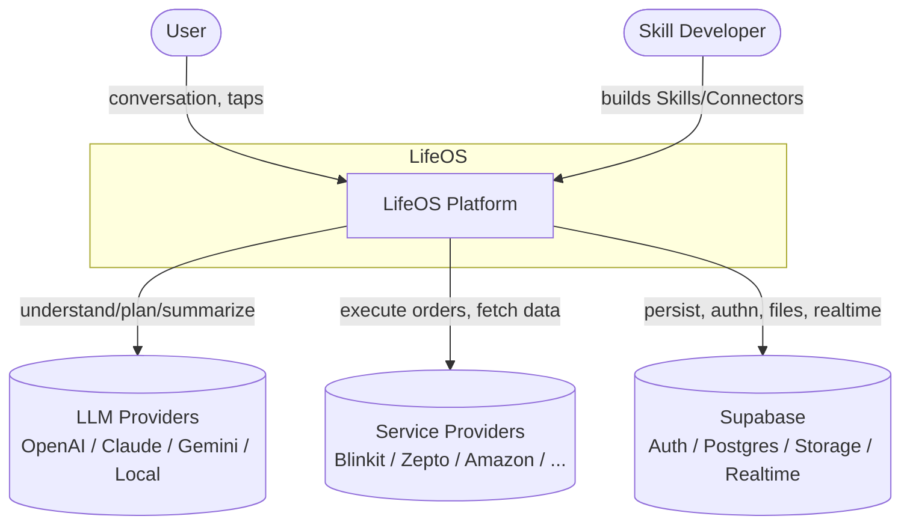

## 3. Container view (C4 L2)

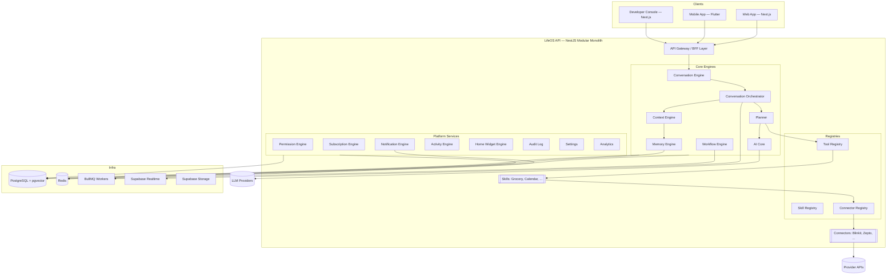

## 4. Layered / hexagonal model

Every module (core engine, platform service, and Skill) follows the same internal hexagon:

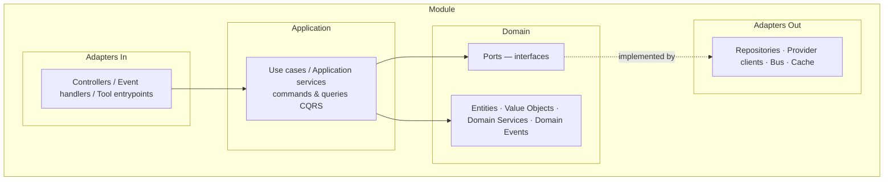

- **Domain** — pure business model and **ports** (interfaces). No framework imports.
- **Application** — orchestrates the domain to fulfill a use case. CQRS where it pays off (commands mutate; queries read from read models — [ADR-0008](adr/adr-0008-event-driven-outbox.md)).
- **Adapters (in)** — HTTP controllers, event subscribers, **tool entrypoints**.
- **Adapters (out)** — repositories (Postgres), provider clients, event bus, cache. Implement domain ports via **Dependency Injection**.

This is why a Skill can be tested with all ports mocked, and why a Postgres repo can be swapped for another store without touching domain logic. See [03 Handbook](03_LifeOS_Engineering_Handbook.md) for the folder layout.

## 5. The Core Platform Components

| Component | Responsibility | One-line contract |
|-----------|----------------|-------------------|
| **AI Core** | Abstracts LLM providers; exposes `complete()`, `embed()`, `stream()` | Skills never touch it; only Planner/Orchestrator/Memory do |
| **Conversation Engine** | Owns conversations, messages, streaming, turn state | Persists every turn; emits `message.received` |
| **Conversation Orchestrator** | Drives a turn: understand → get context → plan → execute → summarize | The brain stem; stateless per turn |
| **Planner** | Turns intent + context into an **Execution Plan** (ordered tool calls) | Produces a plan; never executes it |
| **Workflow Engine** | Executes multi-step / long-running / retryable plans | Durable, resumable, idempotent steps |
| **Context Engine** | Assembles **Unified Context** from DB + Memory + Conversation + Settings + Permissions | Skills consume Context, never raw DB |
| **Memory Engine** | Stores/retrieves facts, preferences, summaries, embeddings; scores & expires | Personalization substrate |
| **Skill Registry** | Registers Skills via manifest; lifecycle & versioning | Core depends on the registry, not Skills |
| **Tool Registry** | Registers tools (capabilities Skills expose); validates I/O; executes | Planner sees tools, not Skills |
| **Connector Registry** | Registers Connectors implementing Provider SDK interfaces | Selects a provider per request |
| **Permission Engine** | Evaluates capability → permission → tool access | Allow/deny + filters Context |
| **Subscription Engine** | Maps plans → capabilities (grants, trials, bundles) | Never gates Skills directly |
| **Notification Engine** | Multi-channel notifications (push/in-app/email) with templates | Skills declare; engine delivers |
| **Activity Engine** | Append-only activity feed; CQRS read models | Powers home feed & history |
| **Home Widget Engine** | Assembles the dynamic home from Skill widget contributions | Nothing hardcoded on home |
| **Developer Console** | Inspect Skills/Tools/Plans/Context/Memory; manage manifests | DX surface |
| **Analytics** | Product & system metrics | Read-only consumer of events |
| **Settings** | User & system configuration | Feeds Context |
| **Audit Log** | Immutable record of sensitive actions | Security & compliance ([11](11_SECURITY_GUIDE.md)) |

## 6. The request lifecycle (message → response)

The canonical path of a user message. This single sequence is the spine of the whole system.

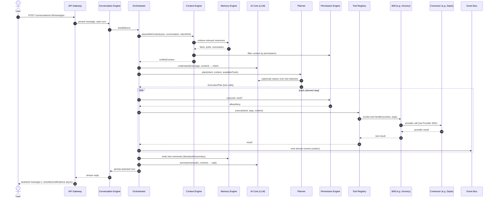

Key invariants visible above: **(a)** the LLM is consulted only to *understand*, *plan*, and *summarize*; **(b)** every tool call passes a permission check; **(c)** Skills are reached *only* via the Tool Registry; **(d)** providers are reached *only* via Connectors; **(e)** side effects emit events through the outbox.

## 7. AI architecture & the logic boundary

The AI's job is exactly four verbs — **Understand, Plan, Execute, Summarize** — and "Execute" means *orchestrating tool calls*, not *implementing them*.

```mermaid
graph LR
    subgraph AI Layer — no business logic
        Understand --> PlanGen[Plan]
        PlanGen --> Execute[Execute = call tools]
        Execute --> Summarize
    end
    subgraph Skill Layer — all business logic
        Tool1[Tool handler]
        Tool2[Tool handler]
    end
    Execute --> Tool1
    Execute --> Tool2
    style AI fill:#0b3d2e,color:#fff
```

- **Skills never call the LLM.** If a Skill needs language work (e.g., classify a note), it does so by exposing the need as a tool input/output and letting the platform mediate, or by requesting an AI capability through a platform service — never by importing the AI Core. *(See [ADR-0004](adr/adr-0004-ai-no-business-logic.md).)*
- **The Planner only produces an `ExecutionPlan`.** It does not mutate state. Execution is the Workflow Engine's / Orchestrator's job via the Tool Registry.
- **Determinism where it matters:** plans are validated against the Tool Registry's schemas before execution; invalid tool calls never run.

**Example `ExecutionPlan` (illustrative):**
```json
{
  "planId": "pl_01HZ...",
  "intent": "restock_groceries",
  "steps": [
    { "tool": "grocery.search_products",
      "args": { "items": ["coffee", "milk"] },
      "dependsOn": [] },
    { "tool": "grocery.build_cart",
      "args": { "strategy": "cheapest_available" },
      "dependsOn": ["grocery.search_products"] },
    { "tool": "grocery.request_confirmation",
      "args": {},
      "dependsOn": ["grocery.build_cart"] }
  ],
  "requiresUserConfirmation": true
}
```

## 8. Context system

> **Everything is Context.** Skills act on a Unified Context, never on raw queries. ([ADR-0007](adr/adr-0007-context-engine.md))

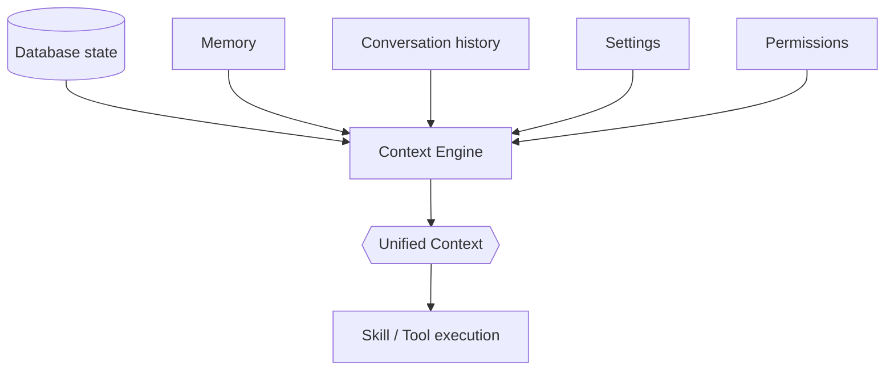

**The Context Engine:**
1. Gathers candidate data from the database, Memory Engine, current conversation, and settings.
2. **Filters** it through the Permission Engine (a Skill only ever sees what the user's capabilities allow).
3. Assembles a typed `UnifiedContext` object passed to every tool handler.
4. Is the **only** sanctioned way for a Skill to learn about the user/world.

**Why this matters:** it centralizes permission filtering, makes every Skill testable with a fabricated context, enables caching, and means a Skill cannot accidentally leak data it shouldn't see. Context assembly is itself cacheable per (user, scope) with TTLs in Redis.

**Illustrative shape:**
```ts
interface UnifiedContext {
  user: { id: string; locale: string; timezone: string };
  capabilities: CapabilityKey[];           // what the user may do
  conversation: { id: string; recentTurns: Turn[] };
  memory: { facts: Fact[]; preferences: Preference[]; summaries: Summary[] };
  settings: Record<string, JsonValue>;
  scope: ContextScope;                       // which Skill asked, for filtering
  now: string;                               // ISO timestamp (no hidden clocks)
}
```

## 9. Memory system

Memory makes LifeOS feel like it *knows* the user. It is tiered, scored, and expiring. ([ADR-0009](adr/adr-0009-pgvector-memory.md))

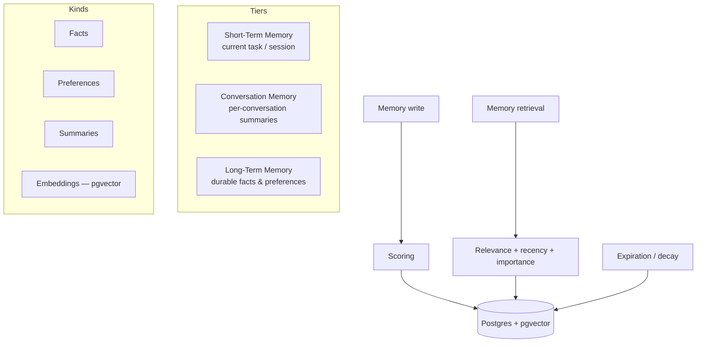

- **Short-Term Memory** — ephemeral working memory for the current task/turn; lives in Redis, expires fast.
- **Conversation Memory** — rolling summaries of a conversation so long threads stay within context windows.
- **Long-Term Memory** — durable **Facts** ("user is vegetarian"), **Preferences** ("prefers Zepto after 9pm"), and **Summaries**, embedded via the AI Core and stored with **pgvector** for semantic retrieval.
- **Memory retrieval** ranks by *semantic relevance × recency × importance* (the **memory score**); the Context Engine pulls the top-k into Unified Context.
- **Memory updates** happen at the end of a turn (Orchestrator writes new facts/prefs/summary).
- **Memory expiration** uses TTLs and decay so stale or low-value memories fade; high-value facts are pinned.

Memory documented in detail and schema'd in [09 Database](09_DATABASE_DESIGN.md); built in [phase-12](../implementation/phase-12-memory-engine.md).

## 10. Skill system

A **Skill** is a self-contained plugin. It owns **everything** for its domain and **nothing** outside it.

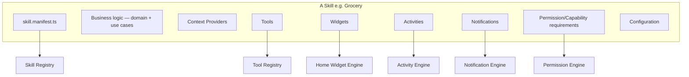

**Registration (plugin model):** at boot, the Skill Registry discovers manifests and registers each Skill's tools, widgets, activities, notifications, capability requirements, and config schema. The **core never imports a Skill**; it reads manifests. (See [skill-template](../templates/skill-template.md).)

**Lifecycle:** `discovered → validated → registered → enabled → (running) → disabled → unregistered`. A Skill can be disabled per-user (capability-gated) or globally (ops) without redeploying the core.

**Versioning:** every manifest declares a `version` and a `contractVersion` (the platform API version it targets). The Skill Registry refuses Skills targeting an incompatible platform contract — semver rules in [10 API Standard](10_API_STANDARD.md).

**Independence rule:** Skill A must never import Skill B. Cross-Skill cooperation happens through **events** (A emits, B reacts) and **shared platform contracts**, never direct calls. This is what lets Skill #50 ship without touching #1–49.

**Future marketplace:** because Skills are manifest-registered plugins with declared capabilities, signing + sandboxing + a registry index is an *additive* feature, not a re-architecture (see [04 §Marketplace](04_LifeOS_Product_Specification.md)).

## 11. Tool system

A **Tool** is the unit the Planner can call. Tools are how Skills expose capability to the AI without the AI knowing about Skills.

- Each tool declares: `name` (namespaced, e.g. `grocery.build_cart`), JSON-schema `input`/`output`, the **capability** it requires, idempotency semantics, and whether it needs user confirmation.
- The **Tool Registry** validates arguments against the schema *before* execution and the result *after*, rejecting malformed calls. This is the safety boundary between a probabilistic planner and deterministic execution.
- Tools receive `(UnifiedContext, args)` and return a typed result. They must be **pure with respect to provider choice** — they call the Connector Registry, which selects the provider.
- **Every mutating tool must consider `followUps`/`followUpsFor`.** These are the one-tap next-step buttons (or the follow-up question a summary reads out) shown after the tool runs — e.g. logging a period day without a flow offers "Log today's flow"; logging a set offers "Finish workout". Declare `followUps` (static) when the next step is always relevant, or `followUpsFor(output, ctx)` (self-aware) when it depends on the result (e.g. only offer it when a field is still missing, or hide it once its own action is a no-op). Only offer a follow-up whose `prompt` can be resolved without an id the Planner doesn't have (read tools and by-name lookups are safe; anything needing a specific record id usually isn't). This is not optional polish — a tool with no next-step story leaves the conversation a dead end. See `skills/wellness/src/tools.ts`'s `wellness.log_day` for the canonical self-aware example.

```ts
interface Tool<I, O> {
  name: string;                        // 'grocery.build_cart'
  inputSchema: JSONSchema;
  outputSchema: JSONSchema;
  requiredCapability: CapabilityKey;   // 'grocery.order'
  idempotent: boolean;
  requiresConfirmation: boolean;
  followUps?: FollowUpSuggestion[];              // static next-step buttons
  followUpsFor?(output: O, ctx: UnifiedContext): FollowUpSuggestion[]; // computed from this run's result
  handler(ctx: UnifiedContext, args: I): Promise<O>;
}
```

## 12. Connector system & Provider SDK

Connectors are swappable adapters to external providers. **No Skill knows which provider executes.** ([ADR-0005](adr/adr-0005-provider-sdk.md))

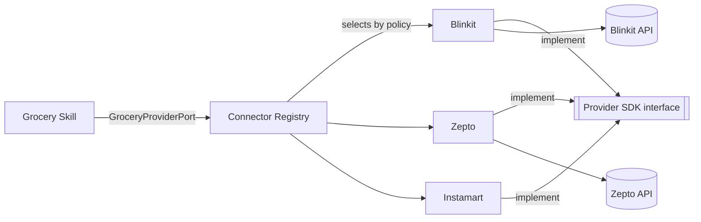

- The **Provider SDK** defines domain-shaped interfaces (ports), e.g. `GroceryProviderPort.searchProducts()`, `createCart()`, `placeOrder()`.
- Each Connector (Blinkit, Zepto, Instamart, Amazon, Flipkart, BigBasket…) implements the relevant SDK interface and maps it to that vendor's API.
- The **Connector Registry** selects a provider per request by policy (availability, price, user preference from Memory, geography). The Skill calls the port; it never names a vendor.
- Connectors are independent packages with their own credentials, rate limits, and health checks. A failing connector is isolated and can be failed-over.

See [connector-template](../templates/connector-template.md) and [phase-11](../implementation/phase-11-connector-registry.md).

## 13. Permission & Subscription model

> **Subscriptions do not unlock Skills.** They grant **capabilities**. ([ADR-0006](adr/adr-0006-capability-permissions.md))

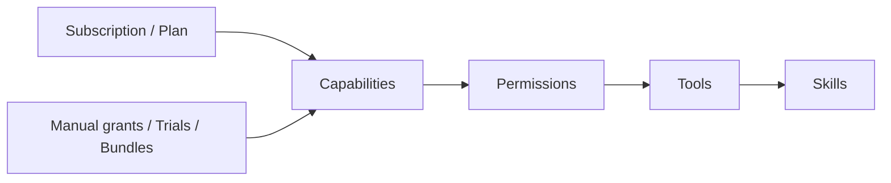

**Why this indirection (and why it's worth it):**
- If subscriptions unlocked Skills directly, every pricing change, trial, promo, or partner bundle would require code changes in Skills. By making **capabilities** the currency, monetization becomes *configuration*.
- A capability (e.g. `grocery.order`, `ai.advanced_planning`, `memory.unlimited`) can be granted by a subscription, a trial, a one-off purchase, an admin grant, or a partner bundle — the Skill is unaffected.
- The **Permission Engine** answers one question everywhere: *does this user, in this context, hold the capability this tool requires?* It also **filters Context** so Skills only see permitted data.

| Concept | Definition | Example |
|---------|------------|---------|
| Subscription | A billing relationship that grants a set of capabilities | "Pro plan" |
| Capability | A fine-grained unit of what a user may do | `grocery.order` |
| Permission | A resolved allow/deny for (user, capability, scope) | allow `grocery.order` for self |
| Tool requirement | The capability a tool needs to run | `grocery.build_cart` needs `grocery.order` |

Built in [phase-07 (Permissions)](../implementation/phase-07-permission-engine.md) **before** [phase-08 (Subscriptions)](../implementation/phase-08-subscription-engine.md) — capabilities exist before anything sells them.

## 14. Event system

Side effects propagate as **domain events**, delivered reliably via the **Outbox pattern** + **BullMQ**. ([ADR-0008](adr/adr-0008-event-driven-outbox.md))

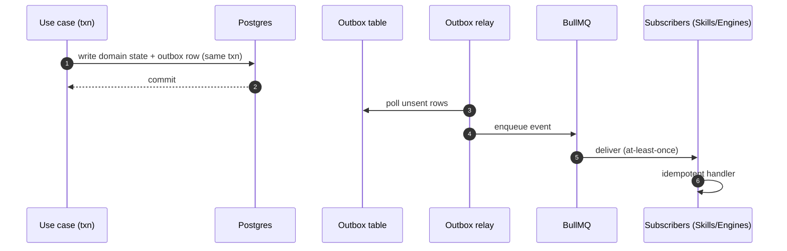

- Writing state and recording the event happen in **one transaction** → no lost or phantom events.
- A relay moves outbox rows to BullMQ; subscribers handle them **idempotently** (events are at-least-once).
- **Activity** and **Home** read models are built by event subscribers (**CQRS**), keeping the home feed fast and decoupled from write paths.
- Cross-Skill cooperation is *only* via events: e.g. Grocery emits `grocery.order_placed`; Finance reacts to record a transaction — with zero coupling.

## 15. Home Widget, Activity, Notification engines

These three turn platform state into the user's surface — all **dynamic, nothing hardcoded**.

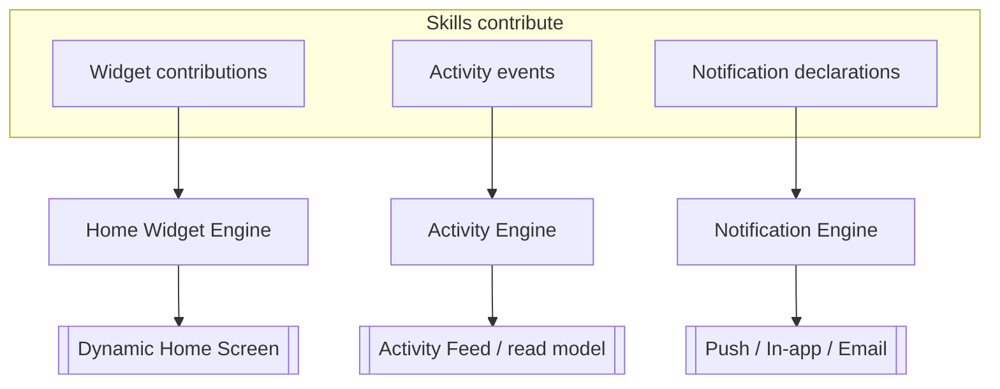

- **Home Widget Engine** — assembles the home screen from widgets that Skills *contribute* via manifest. Layout is data-driven (priority, capability-gating, freshness), so enabling a Skill makes its widget appear with no core change. See [widget-template](../templates/widget-template.md).
- **Activity Engine** — append-only feed of meaningful events (orders, reminders, completions), materialized into read models for fast timelines. See [activity-template](../templates/activity-template.md).
- **Notification Engine** — Skills declare notification *intents*; the engine handles channel selection, templating, batching, quiet hours, and delivery. See [notification-template](../templates/notification-template.md).

## 16. Deployment view

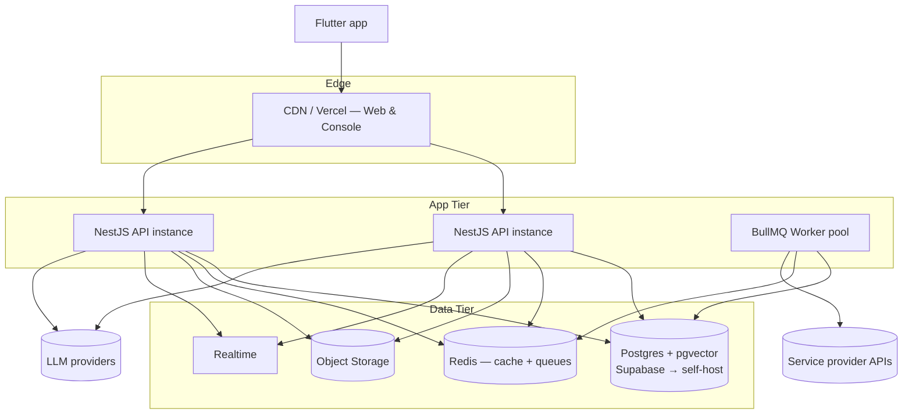

Initially: one horizontally-scalable API deployment + a worker pool + Supabase-managed data. The **module seams** mean a hot module (e.g. AI Core, Memory) can be extracted into its own service later by promoting its in-process port to a network port — no domain rewrite. See [13 Deployment](13_DEPLOYMENT_GUIDE.md).

## 17. Scalability, performance & security analysis

**Scalability**
- *Stateless API* + *worker pool* scale horizontally; conversation state lives in Postgres/Redis, not memory.
- *CQRS read models* absorb read-heavy home/feed traffic independently of writes.
- *Module → service* extraction path (ADR-0001) handles team and load growth without re-architecture.
- *Connector isolation* means a slow vendor degrades one Skill, not the platform.

**Performance**
- Context assembly and memory retrieval are the hot paths → cached in Redis with TTLs; embeddings retrieved via pgvector ANN indexes.
- LLM latency is the dominant cost → streaming responses, plan caching for repeated intents, and provider routing (cheap model for understanding, stronger for planning) via AI Core.
- Tool execution is parallelized where the plan's dependency graph allows.

**Security** (full treatment in [11](11_SECURITY_GUIDE.md))
- *Defense in depth:* RLS at the database, capability checks at the Permission Engine, schema validation at the Tool Registry.
- *Prompt-injection containment:* the AI can only act through registered tools with permission checks — a malicious instruction cannot exceed the user's capabilities.
- *Audit:* every sensitive tool execution and permission decision is written to the immutable Audit Log.
- *Provider isolation:* connector credentials are scoped and never exposed to Skills or the LLM.

---

## Future Evolution

- **Service extraction:** promote AI Core, Memory Engine, and Workflow Engine to standalone services first (highest load / clearest seam).
- **Multi-LLM routing & local models:** AI Core gains a router; no caller changes.
- **Marketplace:** signed, sandboxed third-party Skills/Connectors via the same registries.
- **Multi-tenant orgs/families:** capability model extends from single user to shared principals.
- **Edge context caching:** push Unified Context assembly closer to clients for latency.
