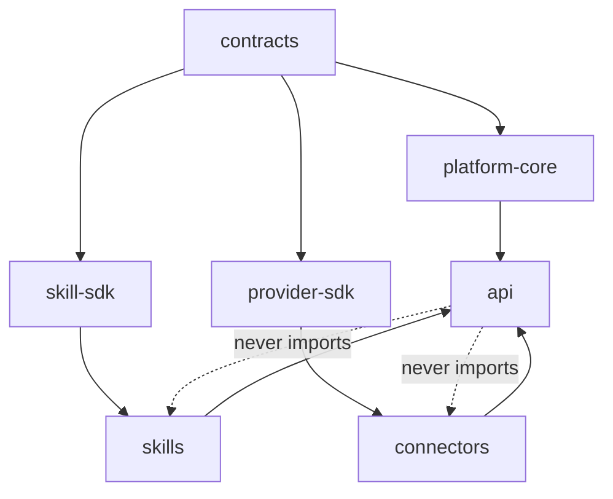

# 03 — LifeOS Engineering Handbook

> How we write code at LifeOS. If [02](02_LifeOS_Platform_Architecture.md) is *what* we build, this is *how* we build it so that 100 engineers and many AI agents produce a coherent codebase.

Related: [02 Architecture](02_LifeOS_Platform_Architecture.md) · [07 AI Agents](07_AI_AGENT_INSTRUCTIONS.md) · [10 API](10_API_STANDARD.md) · [12 Testing](12_TESTING_GUIDE.md) · [templates/](../templates/)

---

## 1. Engineering principles → concrete rules

| Principle | What it means here |
|-----------|--------------------|
| **SOLID** | One reason to change per class; depend on interfaces (ports), not implementations; small, segregated interfaces. |
| **Clean Architecture** | Dependencies point inward; domain is framework-free. |
| **DDD** | Each Skill/engine is a bounded context with its own ubiquitous language (see [14 Glossary](14_GLOSSARY.md)). |
| **CQRS where appropriate** | Separate commands (mutations) from queries (reads); use read models for feeds/home. Not everywhere — only where it pays. |
| **Dependency Injection** | NestJS providers; never `new` an adapter inside the domain. |
| **Repository Pattern** | Persistence behind repository ports; domain never sees SQL/Supabase. |
| **Plugin Architecture** | Skills/Tools/Connectors register via manifests; core imports none of them. |
| **Hexagonal** | Ports & adapters per module (see [02 §4](02_LifeOS_Platform_Architecture.md)). |
| **Everything interface-driven** | Public surface of every module is an interface in `@lifeos/contracts`. |
| **Nothing hardcoded** | Magic values, provider names, and business rules live in config/manifests. |

## 2. Monorepo layout

Turborepo + pnpm workspaces ([ADR-0002](adr/adr-0002-monorepo-turborepo.md)). Described here; scaffolded in [phase-01](../implementation/phase-01-foundation.md).

```
lifeos/
├── apps/
│   ├── api/                 # NestJS modular monolith (the platform)
│   ├── web/                 # Next.js user app
│   ├── console/             # Next.js developer console
│   └── mobile/              # Flutter app
├── packages/
│   ├── contracts/           # @lifeos/contracts — ALL public interfaces, DTOs, events
│   ├── platform-core/       # engine interfaces & shared kernel
│   ├── skill-sdk/           # @lifeos/skill-sdk — base classes, manifest types, test kit
│   ├── provider-sdk/        # @lifeos/provider-sdk — connector interfaces
│   ├── ai-core/             # LLM provider abstraction
│   ├── config/              # typed config loader, schemas, env validation
│   ├── ui/                  # shared React UI
│   ├── tsconfig/            # shared TS configs
│   └── eslint-config/       # shared lint rules (incl. custom LifeOS rules)
├── skills/
│   ├── grocery/             # each Skill = independent package
│   └── calendar/
├── connectors/
│   ├── blinkit/
│   ├── zepto/
│   └── instamart/
├── turbo.json
├── pnpm-workspace.yaml
└── package.json
```

**Dependency direction (enforced by lint + CI):**

`apps/api` depends on **contracts and SDKs**, never on a concrete Skill or Connector — those are wired at runtime by the registries.

## 3. Module folder convention (hexagonal)

Every engine and every Skill uses this internal shape:

```
<module>/
├── domain/
│   ├── entities/            # business objects, invariants
│   ├── value-objects/
│   ├── events/              # domain events (names in past tense)
│   └── ports/               # interfaces the application depends on
├── application/
│   ├── commands/            # write use cases (CQRS command side)
│   ├── queries/             # read use cases (CQRS query side)
│   └── services/            # orchestration of domain
├── adapters/
│   ├── in/                  # controllers, event handlers, tool entrypoints
│   └── out/                 # repositories, provider clients, bus, cache
├── <module>.module.ts       # NestJS DI wiring
└── <module>.manifest.ts     # (Skills only) plugin manifest
```

Rule of thumb: **if a file imports `@nestjs/*`, `pg`, `openai`, or `@supabase/*`, it belongs in `adapters/`, never in `domain/`.**

## 4. Naming conventions

| Thing | Convention | Example |
|-------|-----------|---------|
| Package | `@lifeos/<name>`, kebab | `@lifeos/skill-sdk` |
| Class | PascalCase | `BuildCartCommand` |
| Interface / port | PascalCase, no `I` prefix | `GroceryProviderPort` |
| Tool name | `<skill>.<snake_verb_noun>` | `grocery.build_cart` |
| Capability | `<domain>.<action>` | `grocery.order` |
| Domain event | `<context>.<thing>_<pastTense>` | `grocery.order_placed` |
| Command / Query | imperative + `Command`/`Query` | `PlaceOrderCommand`, `GetHomeFeedQuery` |
| DB table | snake_case plural | `memory_facts` |
| Env var | `LIFEOS_<AREA>_<NAME>` | `LIFEOS_AI_OPENAI_API_KEY` |
| Migration | `NNNN_description.sql` | `0007_add_memory_embeddings.sql` |

Avoid `I`-prefixed interfaces, `Impl` suffixes, and abbreviations not in the [Glossary](14_GLOSSARY.md).

## 5. Error model

A single, typed error envelope across the platform (full spec in [10 API](10_API_STANDARD.md)):

```ts
class LifeOSError extends Error {
  code: string;        // 'PERMISSION_DENIED', 'TOOL_INPUT_INVALID', ...
  status: number;      // HTTP status when surfaced via API
  retryable: boolean;
  details?: JsonValue; // safe, non-sensitive context
  cause?: unknown;
}
```
- Domain throws domain errors; adapters translate to `LifeOSError`.
- **Never** leak provider/LLM internals or PII in `details`.
- Tool failures are values where possible (`{ ok: false, error }`) so the Planner can react; only unexpected faults throw.

## 6. Configuration over hardcoding

- All config goes through `@lifeos/config`: a typed loader that validates env + manifest config against a schema at boot (**fail fast** if invalid).
- **Banned in code** (enforced by custom ESLint rule + review): hardcoded provider names, prices, feature flags, capability strings inline, magic numbers, URLs.
- Feature toggles, provider selection policies, plan→capability maps, and notification templates are **data**, not branches.

```ts
// ❌ never
if (provider === 'zepto' && hour > 21) { ... }
// ✅ instead — policy is configuration the Connector Registry evaluates
const provider = connectorRegistry.select('grocery', ctx, selectionPolicy);
```

## 7. Dependency injection rules

- Wire everything through NestJS modules; constructors take **ports**, not concretes.
- Registries (Skill/Tool/Connector) resolve plugins at runtime — the core module list never names a Skill.
- No service locator / global singletons in domain code. The container is an adapter concern.

## 8. CQRS guidance (when to use it)

| Use commands/queries split when… | Skip it when… |
|----------------------------------|---------------|
| Reads and writes have different shapes/scale (home feed, activity) | Simple CRUD with one consumer |
| You need a fast read model fed by events | Read model == write model |
| Multiple Skills react to a write | No cross-context reaction |

Home Widget Engine and Activity Engine are the canonical CQRS cases (read models built from events).

## 9. Testing standard (summary; full in [12](12_TESTING_GUIDE.md))

- **Unit** — domain logic, no I/O. The bulk of tests.
- **Contract** — every public interface in `@lifeos/contracts` and every SDK port has contract tests; Skills/Connectors are verified against them.
- **Integration** — module + real Postgres/Redis (testcontainers).
- **E2E** — conversation → tools → result through the API.
- Coverage gate: domain & application layers ≥ 90%; overall ≥ 80%. A phase is not done until its tests pass (see each phase's **Definition of Done**).

## 10. Git, branches, commits, PRs

- **Trunk-based** with short-lived branches: `feat/phase-NN-...`, `fix/...`, `docs/...`, `chore/...`.
- **Conventional Commits**: `feat(grocery): add build_cart tool`. Scope = package/Skill.
- One **phase** per PR where possible; PRs reference the phase and update [06 PROJECT_STATE](06_PROJECT_STATE.md).
- **PR must include:** what changed, which phase, contract changes (if any) + version bump, tests, docs updated, and the phase **Review Checklist** ticked.
- **Never** modify a frozen public contract in `@lifeos/contracts` without an ADR + version bump + migration note.
- CI gates: lint, typecheck, dependency-direction check, tests, coverage, build. Red CI never merges.

## 11. Definition of Done (global)

A unit of work is done when **all** hold:
1. Code matches this handbook and [02](02_LifeOS_Platform_Architecture.md).
2. Public surface lives in `@lifeos/contracts` and is versioned.
3. Tests written and green at required coverage.
4. Docs updated (the phase file, and any of 02/09/10 affected).
5. [06 PROJECT_STATE](06_PROJECT_STATE.md) updated.
6. No new hardcoded values, no core→plugin imports, no domain→framework imports.
7. Security-sensitive changes reviewed against [11](11_SECURITY_GUIDE.md).

## 12. Code review heuristics

Reviewers check, in order: **boundaries** (did a dependency point the wrong way?), **contracts** (was a public interface changed safely?), **logic location** (is business logic in a Skill, not the AI or the controller?), **permissions** (is every tool capability-gated?), **tests**, then style. Style is last because the tooling enforces it.

---

## Future Evolution

- A custom ESLint plugin (`@lifeos/eslint-config`) will mechanically enforce dependency direction, no-hardcoding, and tool/capability naming — turning conventions into errors.
- A `lifeos new skill|connector|tool` generator will scaffold from `templates/` so every new artifact is born compliant.
- As services are extracted, this handbook gains an "inter-service contracts" section (gRPC/HTTP) mirroring today's in-process ports.
