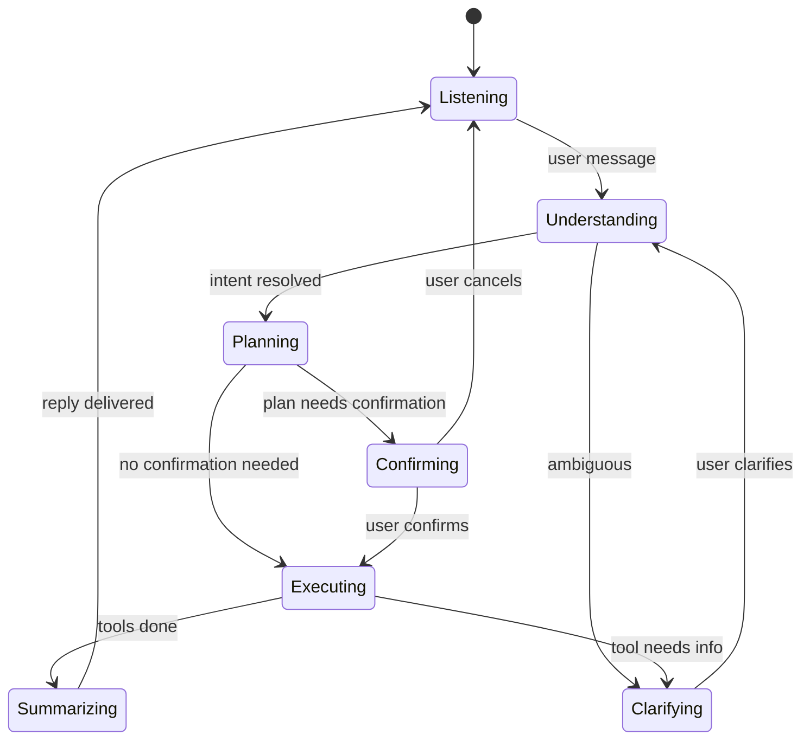
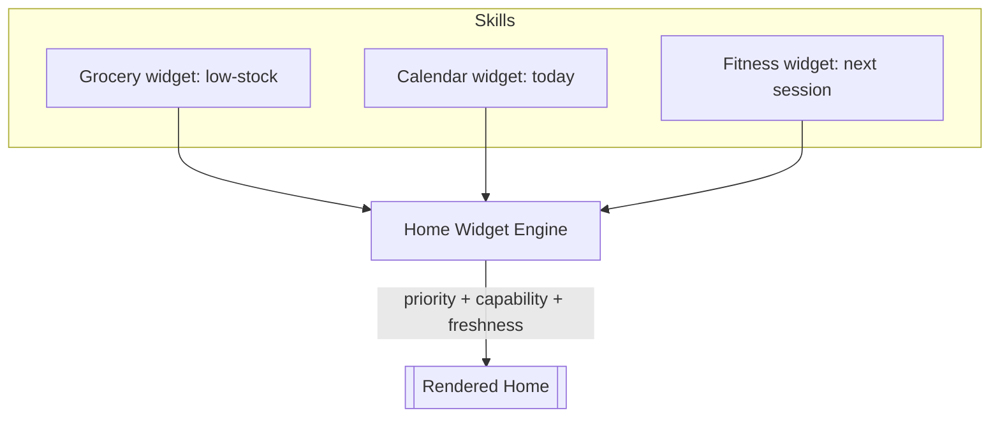
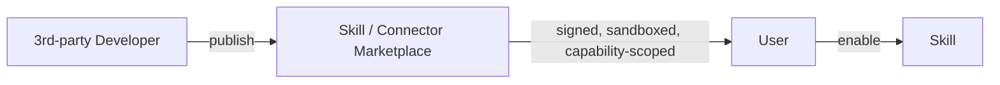

# 04 — LifeOS Product Specification

> Defines the product behavior the platform must deliver. Describes *what the user experiences*; [02](02_LifeOS_Platform_Architecture.md) defines *how it's built*.

Related: [01 Vision](01_LifeOS_Vision.md) · [02 Architecture](02_LifeOS_Platform_Architecture.md) · [14 Glossary](14_GLOSSARY.md)

---

## 1. Product surfaces

| Surface | Tech | Role |
|---------|------|------|
| Conversation | Web + Mobile | Primary surface — the user *talks* to LifeOS |
| Home Screen | Web + Mobile | Dynamic, Skill-contributed widgets, reminders, summaries |
| Activity Feed | Web + Mobile | Timeline of what LifeOS did |
| Settings | Web + Mobile | Preferences, connected providers, subscription |
| Developer Console | Web | Build/inspect Skills, Tools, Plans, Context, Memory |

The product is **conversation-first**: any action achievable via UI is achievable by asking, and UI surfaces are renderings of platform state, not separate logic.

## 2. The conversation model

- A turn produces a reply and may emit **activities** and **notifications**.
- **Confirmation** is required for consequential actions (placing an order, spending money, deleting data) — declared per tool (`requiresConfirmation`).
- **Multi-Skill turns:** one intent may invoke tools across Skills (e.g. "plan my week" → Calendar + Fitness + Grocery). The Orchestrator composes a single plan over all available tools.

## 3. The Skill model (user-facing)

- A user has a set of **enabled Skills**, determined by their **capabilities** (which come from subscription/trials/grants — never bought "per Skill"; see [ADR-0006](adr/adr-0006-capability-permissions.md)).
- Each Skill can contribute to: conversation (its tools), the home screen (widgets), the feed (activities), and notifications.
- Skills are **independent**: enabling/disabling one never affects another.

**Worked example — Grocery (Skill #1):**

> User: "We're out of coffee and milk, order the usual."
>
> 1. Orchestrator assembles Context — Memory says "usual coffee = Brand X, usual milk = 2× toned, prefers fastest provider in evenings."
> 2. Planner emits: `grocery.search_products` → `grocery.build_cart(strategy: usual)` → `grocery.request_confirmation`.
> 3. Connector Registry picks the provider (fastest available now) — user never sees the vendor name unless they ask.
> 4. LifeOS replies with the cart + price and asks to confirm.
> 5. On "yes": `grocery.place_order` runs, emits `grocery.order_placed`.
> 6. **Finance Skill** (if enabled) reacts to the event and logs the spend. **Activity Engine** adds "Ordered groceries — ₹X". **Notification Engine** confirms delivery ETA.

This single flow exercises conversation, context, memory, planning, tools, connectors, permissions, events, activities, and notifications — which is exactly why Grocery is Skill #1.

## 4. Home Screen (dynamic)

- The home screen is **assembled from widget contributions**; nothing is hardcoded. Enable a Skill → its widget can appear. Disable it → gone.
- Ordering is data-driven (priority, urgency, recency), capability-gated, and personalized over time via Memory.
- Widgets are read-only summaries that deep-link into conversation ("Reorder" → opens a pre-filled turn).

## 5. Capability & subscription UX

- Users see **what they can do** (capabilities), surfaced as Skills and actions — not a raw capability list.
- Upgrades grant **capability bundles**; trials grant time-boxed capabilities; partners can grant capabilities via bundles. The UI explains value in product terms ("Unlock automatic reordering"), backed by capabilities underneath.
- Hitting a gated action offers a contextual upgrade ("This needs the *Auto-Order* capability") rather than a hard wall.

## 6. Notifications & activities (UX rules)

- **Activities** are a factual log ("Ordered groceries", "Booked workout") — always available, never noisy.
- **Notifications** are opt-in, respect quiet hours, are batched to avoid spam, and are channel-aware (push vs in-app vs email). Skills declare *intent to notify*; the engine decides delivery (see [02 §15](02_LifeOS_Platform_Architecture.md)).

## 7. Memory & personalization UX

- LifeOS visibly improves: fewer questions over time, better defaults ("the usual"), proactive reminders.
- Users can **inspect and edit memory** ("Forget that I like Brand X", "Always use Zepto") — memory is user-controllable, building trust. Editing memory updates preferences/facts directly.

## 8. Future marketplace (product direction)

Because Skills and Connectors are manifest-registered plugins with declared capabilities ([02 §10–12](02_LifeOS_Platform_Architecture.md)), the marketplace is an **additive** product layer: discovery, signing, sandboxing, review, and revenue share — not a re-architecture. Detailed in a future phase; the platform is built to allow it from day one.

---

## Future Evolution

- **Proactive/ambient mode:** event-triggered suggestions ("You're low on BP medicine — reorder?") without a user prompt.
- **Voice & wearables** as additional conversation surfaces.
- **Shared accounts** (family/team) reusing the capability model.
- **Cross-Skill routines** ("Sunday reset" = groceries + meal plan + calendar) as user-authored macros over tools.
