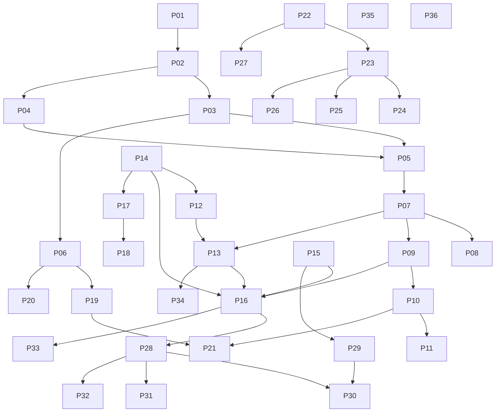

# 05 — Implementation Roadmap

> The ordered, dependency-aware plan to build LifeOS **platform-first**. Each phase is independently completable and leaves the application working. Full per-phase specs live in [`implementation/`](../implementation/); the matching AI prompts in [`prompts/`](../prompts/).

Related: [01 Vision](01_LifeOS_Vision.md) · [02 Architecture](02_LifeOS_Platform_Architecture.md) · [06 PROJECT_STATE](06_PROJECT_STATE.md) · [07 AI Agents](07_AI_AGENT_INSTRUCTIONS.md)

---

## 1. The ordering law

**Never build feature-first. Build platform-first.** Foundation work is never skipped. A phase may only depend on earlier phases. The Grocery Skill cannot start until the framework that hosts *any* Skill exists. (Rationale: [01 §6](01_LifeOS_Vision.md), [ADR-0001](adr/adr-0001-modular-monolith.md).)

## 2. The phases (≈36)

| # | Phase | Band | Depends on | Leaves working |
|---|-------|------|-----------|----------------|
| 01 | Foundation & Monorepo | Platform | — | Repo builds, CI green |
| 02 | Backend Bootstrap (NestJS) | Platform | 01 | API boots, health endpoint |
| 03 | Platform Contracts (`@lifeos/contracts`) | Platform | 02 | Shared interfaces published |
| 04 | Database Foundation + RLS | Platform | 02 | Migrations + base schema |
| 05 | Identity & Auth | Platform | 03,04 | Login, sessions, guards |
| 06 | Event Bus + Outbox + BullMQ | Platform | 03,04 | Reliable events flowing |
| 07 | Permission Engine | Platform | 03,04,05 | Capability checks enforce |
| 08 | Subscription Engine | Platform | 07 | Plans grant capabilities |
| 09 | Tool Registry | Framework | 03,07 | Tools register & validate |
| 10 | Skill Registry & Skill SDK | Framework | 03,09 | Skills register via manifest |
| 11 | Connector Registry & Provider SDK | Framework | 03,10 | Providers register, selectable |
| 12 | Memory Engine (pgvector) | Core | 04,14 | Facts/prefs/embeddings stored |
| 13 | Context Engine | Core | 07,12 | Unified Context assembled |
| 14 | AI Provider Abstraction (OpenAI) | Core | 03 | `complete/embed/stream` |
| 15 | Conversation Engine | Core | 04,06 | Conversations & messages |
| 16 | Conversation Orchestrator | Core | 13,14,15,09 | End-to-end turn loop |
| 17 | Planner | Core | 14,09,16 | ExecutionPlan generation |
| 18 | Workflow Engine | Core | 06,17 | Durable multi-step execution |
| 19 | Activity Engine | Platform | 06 | Activity feed read model |
| 20 | Notification Engine | Platform | 06 | Multi-channel delivery |
| 21 | Home Widget Engine | Platform | 10,19 | Dynamic home assembly |
| 22 | Skill Framework finalization | Framework | 10–21 | Skill can use all engines |
| 23 | Grocery Skill — Domain | Skills | 22 | Grocery tools/logic |
| 24 | Grocery — Context & Memory wiring | Skills | 23,13 | Personalized grocery |
| 25 | Grocery Connectors (Blinkit/Zepto/Instamart) | Connectors | 11,23 | Real provider orders |
| 26 | Grocery — Widgets/Activities/Notifications | Skills | 23,19,20,21 | Full Grocery surface |
| 27 | Second Skill (Calendar) | Skills | 22 | Proves extensibility |
| 28 | API Gateway & API Standard hardening | Platform | 16 | Versioned, consistent API |
| 29 | Realtime Layer | Platform | 15 | Live streaming/updates |
| 30 | Web App (Next.js) | UI | 28,29 | Conversation + Home web |
| 31 | Developer Console | UI | 28 | Inspect plans/context/memory |
| 32 | Mobile App (Flutter) | UI | 28,29 | Conversation + Home mobile |
| 33 | Observability & Audit Logs | Optimization | 16 | Logs/traces/metrics/audit |
| 34 | Performance & Caching (Redis/CQRS) | Optimization | 13,19 | Hot paths cached |
| 35 | Security Hardening | Optimization | all | Threat model satisfied |
| 36 | Production Readiness & Deployment | Production | all | Shippable, runbooked |

## 3. Dependency graph

*(The full graph is acyclic; later phases never block earlier ones.)*

## 4. Milestones

| Milestone | Phases | Meaning |
|-----------|--------|---------|
| **M1 — Platform spine** | 01–08 | Auth, DB, events, permissions, subscriptions |
| **M2 — Plugin framework** | 09–11, 22 | Anything can register: tools, skills, connectors |
| **M3 — AI brain** | 12–18 | Memory, context, conversation, planning, workflows |
| **M4 — Skill #1 (Grocery)** | 23–26 | First end-to-end Skill with real providers |
| **M5 — Extensibility proof** | 27 | A second Skill with zero platform change |
| **M6 — Product surfaces** | 28–32 | Web, mobile, console, realtime |
| **M7 — Production** | 33–36 | Observability, perf, security, deploy |

## 5. How phases are executed

Each phase has a spec in [`implementation/phase-NN-*.md`](../implementation/) (Overview, Objectives, Requirements, Architecture, Folder Structure, Components, Interfaces, Mermaid, Examples, Tests, Acceptance Criteria, **Definition of Done**, AI Coding Prompt, Future Improvements, Known Risks, Dependencies, Time Estimate, Review Checklist) and a one-shot prompt in [`prompts/phase-NN.md`](../prompts/). Phases 01–10 are fully detailed first; 11–36 are scaffolds deepened as they approach.

**Rule:** finish, test, document, and update [06 PROJECT_STATE](06_PROJECT_STATE.md) for one phase before starting the next.

---

## Future Evolution

- Phases 23–27 establish the Skill pattern; subsequent Skills (Fitness, Finance, Travel…) each become a single phase-like unit, not a roadmap rewrite.
- A "service extraction" track will be appended after M7 (promote AI Core / Memory / Workflow to services per [ADR-0001](adr/adr-0001-modular-monolith.md)).
- Marketplace, multi-LLM routing, and proactive mode become their own phase clusters when prioritized.
