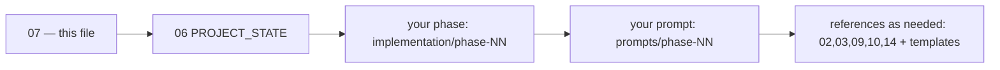
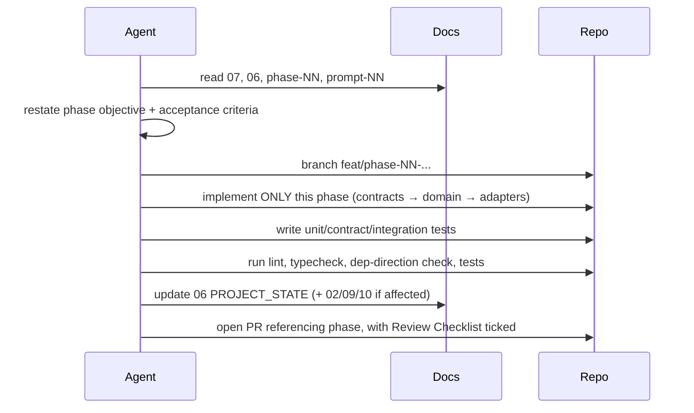

# 07 — AI Agent Instructions

> **You are an AI coding agent working on LifeOS.** This codebase is primarily built by AI agents under human review. These rules are binding. Violating them (especially the contract/phase rules) breaks the build for everyone. Read this fully before writing code.

Related: [00 Index](00_MASTER_INDEX.md) · [03 Handbook](03_LifeOS_Engineering_Handbook.md) · [06 PROJECT_STATE](06_PROJECT_STATE.md) · [12 Testing](12_TESTING_GUIDE.md)

---

## 1. Mandatory reading order (every session)

1. **This file** — the rules.
2. **[06 PROJECT_STATE](06_PROJECT_STATE.md)** — current phase, frozen contracts, known issues. *Never assume; read it.*
3. **Your assigned phase** in `implementation/` — and **only** that one.
4. **The matching `prompts/phase-NN.md`**.
5. Reference docs as needed: [02 Architecture](02_LifeOS_Platform_Architecture.md), [03 Handbook](03_LifeOS_Engineering_Handbook.md), [09 Database](09_DATABASE_DESIGN.md), [10 API](10_API_STANDARD.md), [14 Glossary](14_GLOSSARY.md), and relevant [`templates/`](../templates/).

## 2. The cardinal rules

1. ⛔ **Implement exactly one phase.** Never start, stub, or "prepare" a future phase. If you need something from a future phase, stop and report a dependency problem.
2. ⛔ **Never modify a frozen public contract** (anything in `@lifeos/contracts` listed as frozen in [06](06_PROJECT_STATE.md)). Changing a contract requires a human-approved ADR + version bump. If your phase seems to need it, stop and flag it.
3. ⛔ **Never put business logic in the AI layer.** The LLM only Understands/Plans/Summarizes. Logic lives in Skills ([ADR-0004](adr/adr-0004-ai-no-business-logic.md)).
4. ⛔ **Never import a Skill/Tool/Connector from the core.** Use registries ([ADR-0001](adr/adr-0001-modular-monolith.md)).
5. ⛔ **Never let a Skill query the DB directly.** Skills consume Unified Context ([ADR-0007](adr/adr-0007-context-engine.md)).
6. ⛔ **Never hardcode** provider names, prices, capabilities, or magic values ([03 §6](03_LifeOS_Engineering_Handbook.md)).
7. ✅ **Always gate tools by capability** ([ADR-0006](adr/adr-0006-capability-permissions.md)).
8. ✅ **Always write tests** to the coverage gate ([12](12_TESTING_GUIDE.md)).
9. ✅ **Always update [06 PROJECT_STATE](06_PROJECT_STATE.md)** before opening your PR.

## 3. Development workflow

Build order within a phase: **contracts first** (interfaces in `@lifeos/contracts`), then **domain**, then **application**, then **adapters**, then **wiring/tests**. This keeps the public surface stable and tested before implementation details exist.

## 4. Coding standards

Follow [03 Engineering Handbook](03_LifeOS_Engineering_Handbook.md) exactly: monorepo layout, hexagonal module shape, naming, DI, error model, CQRS guidance. When in doubt, copy the relevant [`templates/`](../templates/). Match the surrounding code's style — do not introduce new patterns without an ADR.

## 5. Testing rules

- Unit-test domain logic with ports mocked; no I/O.
- Add/extend **contract tests** for any public interface or SDK port you touch.
- Integration-test against real Postgres/Redis (testcontainers) where the phase touches persistence.
- A phase is **not done** until its tests pass at the coverage gate (domain/application ≥ 90%, overall ≥ 80%). See [12](12_TESTING_GUIDE.md).

## 6. Documentation updates (part of "done")

- Update the **phase file** if reality diverged from the spec (note deviations).
- Update **[02](02_LifeOS_Platform_Architecture.md)/[09](09_DATABASE_DESIGN.md)/[10](10_API_STANDARD.md)** if you changed structure/schema/API.
- Update **[06 PROJECT_STATE](06_PROJECT_STATE.md)** always.
- Add/extend **[14 Glossary](14_GLOSSARY.md)** if you introduced a domain term.
- New decision? → add an **ADR** ([08](08_ARCHITECTURE_DECISIONS.md)) in the same PR.

## 7. Commit & PR rules

- Conventional Commits, scoped: `feat(grocery): add build_cart tool`.
- One phase per PR where feasible. PR title: `Phase NN — <name>`.
- **PR description must include:** phase link, summary, contract changes + version bump (or "none"), DB migrations (or "none"), tests added, docs updated, and the phase **Review Checklist** ticked.
- CI must be green: lint, typecheck, dependency-direction check, tests, coverage, build.

## 8. When to STOP and ask a human

Stop and report (do not improvise) when:
- Your phase appears to require changing a **frozen contract**.
- A **dependency** from a later phase is missing.
- An **ADR** would be needed (a real architectural choice with trade-offs).
- A **security-sensitive** change is outside what the phase scoped ([11](11_SECURITY_GUIDE.md)).
- The spec is **ambiguous** in a way that changes the public surface.

## 9. Definition of Done (agent checklist)

- [ ] Implemented **only** the assigned phase.
- [ ] No frozen contract changed (or: ADR + version bump approved).
- [ ] No core→plugin import; no domain→framework import; no Skill→DB query.
- [ ] All tools capability-gated; no hardcoded values.
- [ ] Tests written and green at the coverage gate.
- [ ] Docs updated; **[06 PROJECT_STATE](06_PROJECT_STATE.md)** updated.
- [ ] Phase **Acceptance Criteria** all satisfied; app still works.
- [ ] PR opened with Review Checklist ticked.

---

## Future Evolution

- A machine-readable `phase.json` per phase will let agents validate acceptance criteria programmatically.
- CI will auto-check the "no frozen-contract change" and "single-phase scope" rules from the diff.
- An agent-facing `lifeos doctor` command will verify dependency direction and PROJECT_STATE freshness before PR.
