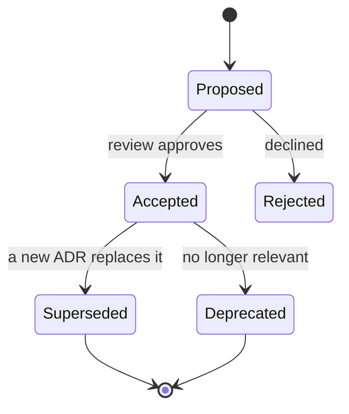

# 08 — Architecture Decisions (ADR System)

> Every significant, hard-to-reverse decision is recorded as an **Architecture Decision Record (ADR)**. Decisions live here, never buried in prose. If you find a decision in code or another doc that isn't an ADR, promote it.

Related: [00 Index](00_MASTER_INDEX.md) · [02 Architecture](02_LifeOS_Platform_Architecture.md) · [`adr/`](adr/)

---

## 1. What an ADR is

A short, immutable-once-accepted record capturing **the context, the options, the trade-offs, the decision, and its consequences**. ADRs are how a 100-engineer / many-AI-agent project remembers *why* — so nobody re-litigates settled questions or accidentally violates a constraint.

## 2. ADR format (template)

Every ADR (`adr/adr-NNNN-slug.md`) uses this structure:

```
# ADR-NNNN — <Title>
- Status: Proposed | Accepted | Superseded by ADR-XXXX | Deprecated
- Date: YYYY-MM-DD
- Deciders: <roles>
- Tags: <area>

## Context
The forces at play; what problem requires a decision.

## Options considered
Option A — … (pros / cons)
Option B — … (pros / cons)
Option C — … (pros / cons)

## Trade-offs
Explicit comparison across the axes that matter (cost, velocity, scale, risk, DX).

## Decision
The chosen option, stated unambiguously.

## Consequences
Positive, negative, and what becomes easier/harder. Follow-on obligations.

## Future impact
What this enables or constrains over a 10-year horizon; revisit triggers.
```

## 3. Lifecycle & statuses



- **Proposed** ADRs are reviewed in a PR.
- **Accepted** ADRs are binding and immutable; to change a decision, write a **new** ADR that *supersedes* the old one (the old one stays, marked Superseded, with a pointer).
- Numbers are never reused.

## 4. When you need an ADR

Write one when a choice is **significant and costly to reverse**: a structural pattern, a cross-cutting technology, a public-contract shape, a security model, a data model with wide blast radius. Routine, local choices do **not** need ADRs. If unsure, the test is: *"Would a future engineer be confused or harmed by not knowing why?"*

## 5. ADR index (in force)

| ADR | Title | Status | Summary |
|-----|-------|--------|---------|
| [0001](adr/adr-0001-modular-monolith.md) | Modular Monolith, microservice-ready | Accepted | One deployable now; clean seams to extract services later |
| [0002](adr/adr-0002-monorepo-turborepo.md) | Monorepo with Turborepo + pnpm | Accepted | Shared contracts, atomic changes, one CI graph |
| [0003](adr/adr-0003-hexagonal-ddd.md) | Hexagonal + DDD per module | Accepted | Ports & adapters isolate domain from frameworks/providers |
| [0004](adr/adr-0004-ai-no-business-logic.md) | AI holds no business logic | Accepted | LLM only understands/plans/summarizes; logic in Skills |
| [0005](adr/adr-0005-provider-sdk.md) | Provider SDK / Connector abstraction | Accepted | Skills are provider-agnostic |
| [0006](adr/adr-0006-capability-permissions.md) | Capability-based permissions | Accepted | Subscription→Capability→Permission→Tool→Skill |
| [0007](adr/adr-0007-context-engine.md) | Context Engine boundary | Accepted | Skills consume Unified Context, not raw DB |
| [0008](adr/adr-0008-event-driven-outbox.md) | Event-driven with Outbox + CQRS | Accepted | Reliable async; read models for feeds/home |
| [0009](adr/adr-0009-pgvector-memory.md) | pgvector for memory embeddings | Accepted | One datastore; revisit at scale |
| [0010](adr/adr-0010-supabase-baas.md) | Supabase as initial BaaS + exit strategy | Accepted | Speed now; abstractions prevent lock-in |

---

## Future Evolution

- ADRs 0011+ will record: service-extraction boundaries, multi-LLM routing policy, marketplace trust/signing model, and the eventual self-host migration trigger.
- A `docs:adr` script will lint ADR front-matter and regenerate this index automatically.
