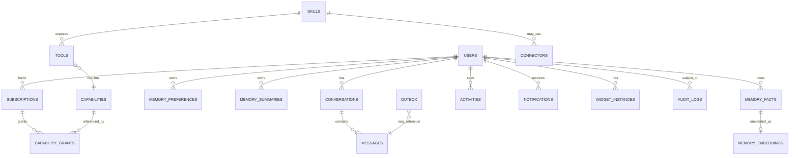

# 09 — Database Design

> The canonical data model. Postgres (via Supabase initially, [ADR-0010](adr/adr-0010-supabase-baas.md)) with `pgvector` for embeddings ([ADR-0009](adr/adr-0009-pgvector-memory.md)). Schemas shown are **illustrative**; the normative source is migrations once code exists. Skills never query these tables directly — they go through the Context Engine ([ADR-0007](adr/adr-0007-context-engine.md)).

Related: [02 Architecture](02_LifeOS_Platform_Architecture.md) · [10 API](10_API_STANDARD.md) · [11 Security](11_SECURITY_GUIDE.md) · [database-template](../templates/database-template.md)

---

## 1. Principles

- **Multi-tenant by `user_id`** with **Row-Level Security (RLS)** on every user-owned table — a query can only ever see its own user's rows. Defense in depth with the Permission Engine ([11](11_SECURITY_GUIDE.md)).
- **Schema-per-domain namespacing** for clarity: `platform.*` (users, auth, audit), `memory.*`, `conversation.*`, `catalog.*` (skills/tools/connectors/capabilities), `billing.*`, `surface.*` (activities/notifications/widgets), and one schema per Skill (e.g. `grocery.*`). Keeps bounded contexts visible and makes future service extraction a schema move.
- **UUIDv7** primary keys (time-sortable) named `id`; foreign keys `<entity>_id`.
- **`created_at` / `updated_at`** `timestamptz` on every table; soft-delete via `deleted_at` where history matters.
- **Append-only** for `audit_logs`, `activities`, and `outbox` (no updates/deletes).
- **Migrations** are forward-only, numbered `NNNN_description.sql`, reviewed, and reversible-by-new-migration. The latest number is the **Database version** in [06 PROJECT_STATE](06_PROJECT_STATE.md).
- **No business logic in the DB** beyond constraints, RLS, and simple triggers (e.g. `updated_at`). Logic lives in Skills/engines.

## 2. Core entity-relationship overview



## 3. Table catalog (illustrative)

### platform.users
| col | type | notes |
|-----|------|------|
| id | uuid pk | mirrors Supabase auth user id |
| email | citext unique | |
| locale | text | e.g. `en-IN` |
| timezone | text | IANA, e.g. `Asia/Kolkata` |
| created_at / updated_at | timestamptz | |

### conversation.conversations / conversation.messages
```sql
create table conversation.conversations (
  id uuid primary key default uuidv7(),
  user_id uuid not null references platform.users(id),
  title text,
  created_at timestamptz not null default now(),
  updated_at timestamptz not null default now()
);
create table conversation.messages (
  id uuid primary key default uuidv7(),
  conversation_id uuid not null references conversation.conversations(id),
  user_id uuid not null references platform.users(id),
  role text not null check (role in ('user','assistant','tool','system')),
  content jsonb not null,            -- text + tool calls/results
  turn_id uuid,                      -- groups a turn's messages
  created_at timestamptz not null default now()
);
-- RLS: user_id = auth.uid()
```

### memory.* (with pgvector)
```sql
create extension if not exists vector;

create table memory.facts (
  id uuid primary key default uuidv7(),
  user_id uuid not null references platform.users(id),
  scope text not null,               -- e.g. 'grocery', 'global'
  statement text not null,           -- "user is vegetarian"
  importance smallint not null default 1,   -- pin high-value facts
  source text,                       -- conversation id / tool
  expires_at timestamptz,            -- null = durable
  created_at timestamptz not null default now()
);

create table memory.preferences (
  id uuid primary key default uuidv7(),
  user_id uuid not null references platform.users(id),
  scope text not null,
  key text not null,                 -- 'grocery.preferred_provider'
  value jsonb not null,              -- 'zepto'
  unique (user_id, scope, key)
);

create table memory.summaries (
  id uuid primary key default uuidv7(),
  user_id uuid not null references platform.users(id),
  conversation_id uuid references conversation.conversations(id),
  summary text not null,
  created_at timestamptz not null default now()
);

create table memory.embeddings (
  id uuid primary key default uuidv7(),
  user_id uuid not null references platform.users(id),
  owner_kind text not null,          -- 'fact' | 'summary'
  owner_id uuid not null,
  embedding vector(1536) not null,
  created_at timestamptz not null default now()
);
create index on memory.embeddings using hnsw (embedding vector_cosine_ops);
```
**Memory scoring / retrieval:** retrieval ranks candidates by `semantic_similarity × recency_decay × importance`. Short-term memory lives in **Redis** (not Postgres) and expires fast; conversation memory = `summaries`; long-term = `facts` + `preferences`. Expiration sweeps drop rows past `expires_at` and decay low-importance, low-recency facts.

### catalog.* (plugin registry persistence)
| table | purpose |
|-------|---------|
| `catalog.skills` | registered Skills: key, version, contract_version, status, manifest jsonb |
| `catalog.tools` | tools: name, skill_id, input_schema, output_schema, required_capability, idempotent, requires_confirmation |
| `catalog.connectors` | connectors: key, domain, status, health, config jsonb |
| `catalog.capabilities` | capability keys: key, description, domain |

> These persist what the in-memory registries discovered from manifests, enabling the Dev Console and per-user enable/disable without redeploy.

### billing.* (subscriptions → capabilities)
| table | purpose |
|-------|---------|
| `billing.plans` | plan definitions |
| `billing.plan_capabilities` | **map** plan → capability keys (data, not code) |
| `billing.subscriptions` | user_id, plan_id, status, period |
| `billing.capability_grants` | resolved/explicit grants: user_id, capability_key, source (subscription/trial/admin/bundle), expires_at |

This is the persistence behind [ADR-0006](adr/adr-0006-capability-permissions.md): subscriptions never reference Skills; they reference capabilities.

### surface.* (activities, notifications, widgets)
| table | purpose |
|-------|---------|
| `surface.activities` | append-only feed (CQRS read model fed by events) |
| `surface.notifications` | queued/sent notifications, channel, status |
| `surface.widget_instances` | per-user materialized home widgets (read model) |

### platform.audit_logs (immutable)
```sql
create table platform.audit_logs (
  id uuid primary key default uuidv7(),
  user_id uuid,
  actor text not null,               -- user | system | skill:grocery
  action text not null,              -- 'tool.execute', 'permission.deny'
  resource text,
  decision text,                     -- allow | deny | n/a
  metadata jsonb,                    -- non-sensitive
  created_at timestamptz not null default now()
);
-- no update/delete grants; append-only
```

### platform.outbox (event reliability)
```sql
create table platform.outbox (
  id uuid primary key default uuidv7(),
  aggregate text not null,
  event_type text not null,          -- 'grocery.order_placed'
  payload jsonb not null,
  occurred_at timestamptz not null default now(),
  published_at timestamptz           -- null until relayed to BullMQ
);
create index on platform.outbox (published_at) where published_at is null;
```
The outbox row is written **in the same transaction** as the domain change ([ADR-0008](adr/adr-0008-event-driven-outbox.md)); a relay publishes unsent rows to BullMQ.

### <skill>.* (per-Skill schema — e.g. grocery)
Each Skill owns its tables in its own schema (e.g. `grocery.carts`, `grocery.orders`, `grocery.product_prefs`). Skills migrate their own schema; the platform never reads Skill tables — only the Skill does, and only it exposes data via Context Providers and tools.

## 4. Row-Level Security pattern

Every user-owned table enables RLS and uses a single policy shape:
```sql
alter table memory.facts enable row level security;
create policy facts_owner on memory.facts
  using (user_id = auth.uid())
  with check (user_id = auth.uid());
```
RLS is the **last line**; the **Permission Engine** is the first ([11 Security](11_SECURITY_GUIDE.md)). Both must agree.

## 5. Migrations & versioning

- Tooling: SQL migrations applied in order (Supabase migrations / a runner). Forward-only.
- Each migration is reviewed; schema-breaking changes that touch a public contract need an ADR.
- The latest migration number is recorded as **Database version** in [06 PROJECT_STATE](06_PROJECT_STATE.md) and bumped in the same PR.
- Backfills run as idempotent, batched jobs (BullMQ), never as part of the migration transaction.

## 6. Indexing & performance notes

- Hot read paths (home/feed) are served by **read-model tables** (`surface.*`) fed by events — not by joining write tables.
- Memory retrieval uses an **HNSW** index on `memory.embeddings`.
- Conversation reads are paginated by `created_at`/`id` (keyset pagination, [10 API](10_API_STANDARD.md)).
- Redis caches Unified Context and short-term memory; Postgres remains the source of truth.

---

## Future Evolution

- **Service extraction:** schema-per-domain means a context (e.g. `memory.*`) can move to its own database with minimal app change.
- **Partitioning** of `messages`, `activities`, `audit_logs`, and `outbox` by time as volume grows.
- **Dedicated vector store** only if pgvector becomes a bottleneck (revisit trigger in [ADR-0009](adr/adr-0009-pgvector-memory.md)).
- **Read replicas** for analytics; CDC to a warehouse for [33 Analytics](05_IMPLEMENTATION_ROADMAP.md).
