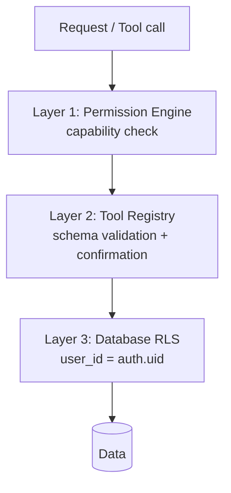

# 11 — Security Guide

> The security model is **defense in depth**: independent layers that each enforce access, so a failure in one does not breach the user. This is especially important for an AI-driven system where a probabilistic planner sits in the request path.

Related: [02 Architecture](02_LifeOS_Platform_Architecture.md) · [09 Database](09_DATABASE_DESIGN.md) · [10 API](10_API_STANDARD.md) · [ADR-0006](adr/adr-0006-capability-permissions.md)

---

## 1. Threat model (STRIDE-lite)

| Threat | Example | Primary control |
|--------|---------|-----------------|
| **Spoofing** | Forged identity | Supabase Auth + signed sessions; `auth.uid()` everywhere |
| **Tampering** | Mutating others' data | RLS + Permission Engine + input validation |
| **Repudiation** | "I didn't order that" | Immutable Audit Log of sensitive actions |
| **Information disclosure** | Cross-user data leak | RLS + Context Engine permission filtering |
| **Denial of service** | Cost/abuse via LLM endpoints | Rate limits, budgets, queue isolation |
| **Elevation of privilege** | Gaining a capability you lack | Capability checks at the Tool Registry |
| **Prompt injection** | Malicious text steering the AI | Capability-bounded tools; no logic in AI |

## 2. The three enforcement layers

1. **Permission Engine** — every tool requires a capability; the engine answers allow/deny for (user, capability, scope) and **filters Context** so Skills only see permitted data. ([ADR-0006](adr/adr-0006-capability-permissions.md))
2. **Tool Registry** — validates tool input/output against JSON schemas and enforces `requiresConfirmation` for consequential actions, so a bad/hostile plan cannot execute malformed or unconfirmed operations.
3. **Database RLS** — the final guarantee: even a logic bug can't read another user's rows. ([09 §4](09_DATABASE_DESIGN.md))

These three must **independently agree**. No single layer is trusted alone.

## 3. AI-specific threats

**Prompt injection is contained by design, not by filtering.** The AI cannot perform any action except by emitting a tool call, and every tool call is permission-checked and schema-validated. Therefore the **worst** a successful injection can do is attempt actions the *user already has capability for* — and consequential ones still require confirmation. Mitigations:
- The LLM holds **no business logic and no secrets** ([ADR-0004](adr/adr-0004-ai-no-business-logic.md)); it never sees provider credentials or other users' data.
- Untrusted content (provider responses, documents) is treated as **data, not instructions**, and is never concatenated into system prompts with authority.
- Plans are validated against the Tool Registry before execution; unknown/malformed tool calls are rejected.
- High-impact tools set `requiresConfirmation: true`.

## 4. Secrets management

- All secrets via `@lifeos/config` from the environment/secret manager — **never** in code, manifests, logs, or the DB.
- **Connector credentials** are scoped per connector and never exposed to Skills, the AI, or clients ([ADR-0005](adr/adr-0005-provider-sdk.md)).
- Rotate keys regularly; least-privilege service roles for Supabase.

## 5. Data classification & PII

| Class | Examples | Handling |
|-------|----------|----------|
| Secret | API keys, tokens | secret manager only; never logged |
| Sensitive PII | health (Medicines/Wellness Skills), finance | encrypted at rest, access-audited, minimized in Context |
| Personal | name, email, addresses | RLS, capability-gated |
| Operational | activity logs (non-sensitive) | standard retention |

- **Data minimization:** Context Engine includes only what a tool needs for its scope.
- Health and finance Skills are high-sensitivity; their Context Providers must mark fields and the engine excludes them from any cross-Skill context.

## 6. Tool execution safety

- Tools run in-process but behind validated inputs and capability checks; long/external work runs in the **Workflow Engine** with timeouts, retries (idempotent only), and circuit breakers around Connectors.
- A misbehaving Connector is isolated (bulkhead) and failed-over; it cannot take down the platform.

## 7. Audit logging

- Every **sensitive** action and **permission decision** writes an immutable `platform.audit_logs` row ([09](09_DATABASE_DESIGN.md)): tool executions that spend money / change data, permission denials, capability grants, admin actions.
- Audit entries carry **no sensitive payloads** — references and decisions only.

## 8. Transport, sessions, abuse

- HTTPS everywhere; HSTS. Short-lived access tokens + refresh; revoke on logout.
- Rate limits and LLM cost budgets per user/capability at the gateway ([10 §10](10_API_STANDARD.md)).
- Standard web hardening (CORS allowlist, CSRF for cookie flows, security headers, dependency scanning in CI).

## 9. Secure SDLC

- Dependency and secret scanning in CI; no merge on high-severity findings.
- Security-sensitive PRs get a focused review against this guide ([07 §8](07_AI_AGENT_INSTRUCTIONS.md): agents must stop and flag security changes outside scope).
- Threat-model review is part of [phase-35 Security Hardening](05_IMPLEMENTATION_ROADMAP.md) and revisited per new Skill that handles sensitive data.

---

## Future Evolution

- **Marketplace sandboxing:** third-party Skills/Connectors run with signed manifests, capability allowlists, and resource isolation.
- **Field-level encryption** and per-Skill data vaults for the most sensitive domains.
- **Anomaly detection** on the audit stream (unusual capability use, spend spikes).
- **Compliance** (GDPR/India DPDP) data-subject flows: export/delete built on the per-user, RLS-scoped model.
