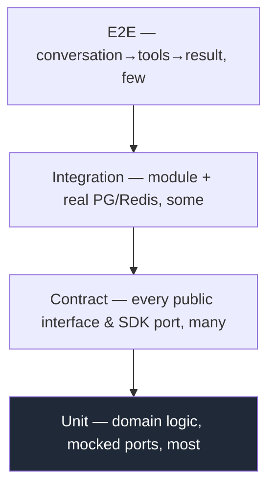
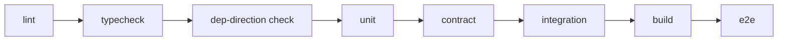

# 12 — Testing Guide

> How we prove correctness. Tests are part of the **Definition of Done** — a phase is not complete until its tests pass at the required gate. Testing strategy is shaped by two LifeOS-specific facts: it is **plugin-based** (contracts must be verified) and **AI-driven** (non-determinism must be tamed).

Related: [03 Handbook](03_LifeOS_Engineering_Handbook.md) · [07 AI Agents](07_AI_AGENT_INSTRUCTIONS.md) · [10 API](10_API_STANDARD.md)

---

## 1. The test pyramid

| Level | Scope | Tools | Speed |
|-------|-------|-------|-------|
| **Unit** | Domain/application logic, ports mocked, no I/O | Jest (TS), `flutter test` (Dart) | ms |
| **Contract** | Public interfaces in `@lifeos/contracts` and SDK ports | shared contract test suites | ms |
| **Integration** | Module + real Postgres/Redis/queue | Testcontainers | s |
| **E2E** | Full turn through the API | Supertest / Playwright (web) | s–min |

## 2. Contract tests (the keystone for a plugin platform)

Because Skills, Tools, and Connectors are plugins, **the platform's guarantees are its contracts**. Every public interface ships a reusable **contract test suite** that any implementation must pass:

- `@lifeos/skill-sdk` exports `runSkillContractTests(skill)` — verifies manifest validity, tool schemas, capability declarations, lifecycle.
- `@lifeos/provider-sdk` exports `runProviderContractTests(connector)` — verifies every port method against a recorded fixture set.
- `@lifeos/contracts` ships tests for `Tool`, `UnifiedContext`, `DomainEvent`, `LifeOSError`.

A new Grocery connector (Zepto) is "correct" iff it passes `runProviderContractTests`. This is how we add Skill #50 and Connector #N safely.

## 3. Testing the AI layer (non-determinism)

We do **not** assert on exact LLM prose. Instead:
- **Mock the AI Core** in unit/integration tests — the Planner/Orchestrator are tested against deterministic fake completions and fixed `ExecutionPlan`s.
- **Plan validation tests** assert that a given intent+context yields a plan whose tool calls are valid against the Tool Registry (structure, not wording).
- **Tool handlers are fully deterministic** and unit-tested in isolation (this is where logic lives — [ADR-0004](adr/adr-0004-ai-no-business-logic.md)).
- **Golden/eval tests** (separate, non-blocking suite) run real LLMs against curated intents and score plan quality over time — used for regression tracking, not as a CI gate.
- **Property tests** for context assembly and memory scoring (invariants hold for any input).

## 4. Coverage gates

| Layer | Minimum |
|-------|---------|
| Domain + application | **90%** |
| Overall | **80%** |
| Public contracts / SDK ports | **100% of methods have contract tests** |

CI fails below gate. Coverage is necessary, not sufficient — reviewers still check that tests assert behavior, not just execute lines.

## 5. Fixtures & data

- **Factories** build domain objects; no shared mutable fixtures.
- **Testcontainers** spin ephemeral Postgres (with pgvector) + Redis per integration run; migrations applied fresh.
- **Recorded provider fixtures** (sanitized) drive connector contract tests offline — no live vendor calls in CI.
- `UnifiedContext` builders make Skill tests trivial (fabricate context, no DB).

## 6. What every phase must include

Each `implementation/phase-NN-*.md` lists its required tests. Minimum:
- Unit tests for new domain/application logic.
- Contract tests for any new/changed public interface or SDK port.
- Integration tests for new persistence or queues.
- For Skills/Connectors: pass the relevant SDK contract suite.
- For API phases: E2E for the new endpoints.

## 7. CI test stages

All stages must pass to merge ([07 §7](07_AI_AGENT_INSTRUCTIONS.md)). Integration/E2E run on PR and main; the LLM eval suite runs nightly.

---

## Future Evolution

- **Mutation testing** on domain packages to validate test strength.
- **Contract-test versioning** so a Skill can declare which platform contract version it was verified against.
- **Load/soak tests** for the conversation path and memory retrieval as part of [phase-34](05_IMPLEMENTATION_ROADMAP.md).
- **Eval dashboards** tracking plan-quality regression across LLM provider/model changes.
