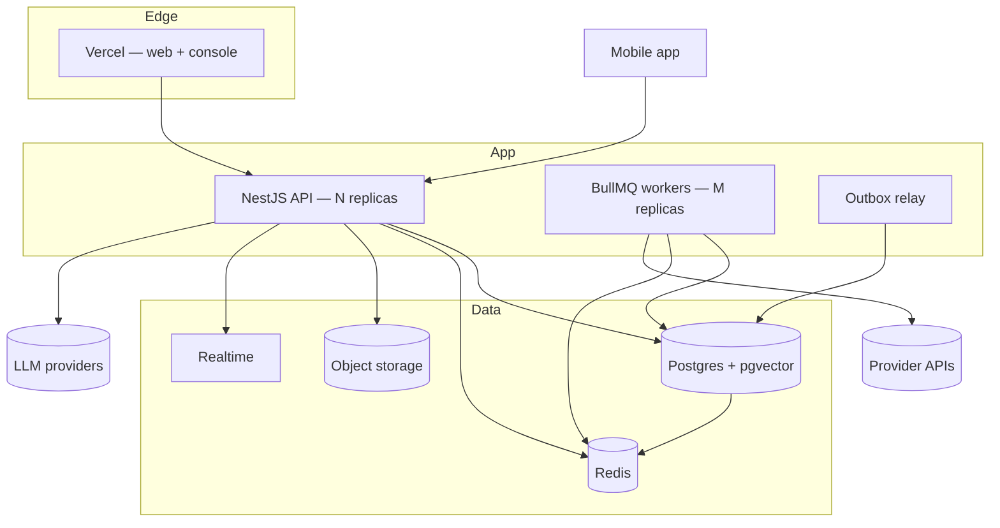
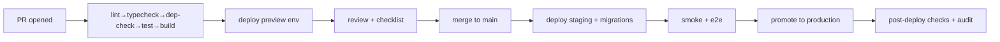
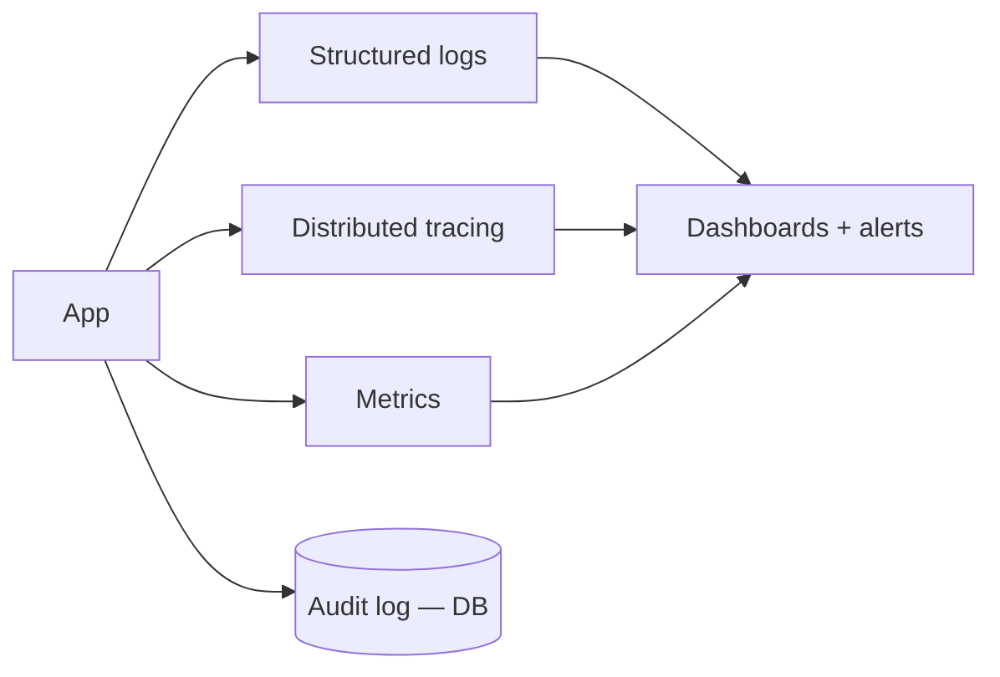
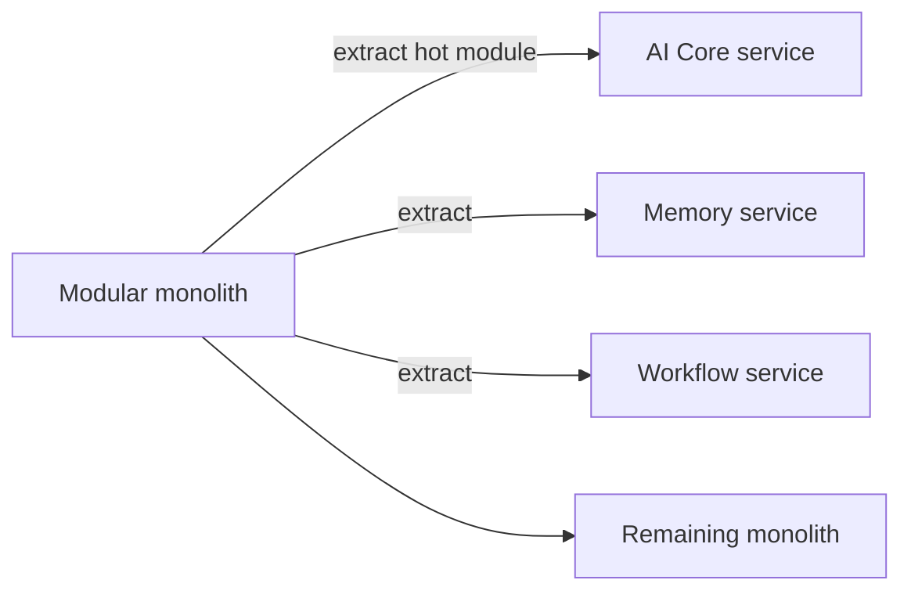

# 13 — Deployment Guide

> How LifeOS ships and scales. The deployment story mirrors the architecture: one deployable now (modular monolith), with a documented path to many services and off Supabase later.

Related: [02 Architecture](02_LifeOS_Platform_Architecture.md) · [ADR-0001](adr/adr-0001-modular-monolith.md) · [ADR-0010](adr/adr-0010-supabase-baas.md) · [11 Security](11_SECURITY_GUIDE.md)

---

## 1. Environments

| Env | Purpose | Data |
|-----|---------|------|
| `local` | Developer machine | Docker: Postgres+pgvector, Redis; Supabase local or test project |
| `preview` | Per-PR ephemeral | Throwaway DB branch, seeded |
| `staging` | Pre-prod, prod-like | Isolated Supabase project + Redis |
| `production` | Live | Managed Postgres, Redis, object storage, realtime |

Config per env via `@lifeos/config` (validated at boot). No env-specific code branches — only config.

## 2. Topology (initial)

- **API** is stateless and horizontally scaled. **Workers** process BullMQ jobs (workflows, notifications, outbox relay, backfills). The **outbox relay** publishes domain events ([ADR-0008](adr/adr-0008-event-driven-outbox.md)).
- Web/console deploy to Vercel (Next.js); mobile ships via app stores (Flutter).

## 3. CI/CD pipeline

- Turborepo caches builds; only affected packages rebuild/test.
- **Migrations** run as a gated, ordered step before app rollout ([09 §5](09_DATABASE_DESIGN.md)); forward-only, reviewed.
- **Rollout** is rolling/blue-green; health checks gate promotion. **Rollback** = redeploy previous image + (if needed) a forward-fix migration — never destructive down-migrations in prod.

## 4. Configuration & secrets

- 12-factor: all config from env/secret manager, validated at boot (fail fast).
- Secrets never in images, logs, or the repo ([11 §4](11_SECURITY_GUIDE.md)). Connector credentials scoped per connector.

## 5. Observability (deployed)

Built in [phase-33](05_IMPLEMENTATION_ROADMAP.md): structured logs with `requestId`/`turnId`, tracing across orchestrator→tools→connectors, metrics on LLM latency/cost, queue depth, and tool error rates. Alerts on error budgets and spend.

## 6. Scaling story (monolith → services)

Because modules communicate through **ports** and **events**, extracting a hot module means promoting an in-process port to a network port (HTTP/gRPC) — no domain rewrite ([ADR-0001](adr/adr-0001-modular-monolith.md)). Extract by load/team pressure, not speculatively. AI Core, Memory, and Workflow are the likely first services.

## 7. Supabase → self-host exit path

LifeOS uses Supabase for speed, behind abstractions ([ADR-0010](adr/adr-0010-supabase-baas.md)):
- Auth behind an `AuthPort`; Postgres behind repositories; Storage behind a `StoragePort`; Realtime behind a `RealtimePort`.
- Exit = swap adapters to self-hosted Postgres + an auth provider + S3-compatible storage + a realtime gateway. Schema is standard Postgres; no Supabase-only features are load-bearing in the domain.

## 8. Runbooks (skeleton — fleshed out in phase-36)

- **Deploy / rollback** — pipeline steps + manual override.
- **Migration failure** — halt rollout, forward-fix, replay.
- **LLM provider outage** — AI Core fails over to alternate provider/model.
- **Connector outage** — circuit-break + provider failover; degrade one Skill only.
- **Queue backlog** — scale workers; inspect dead-letter; replay.
- **Incident** — severity, on-call, comms, audit-trail review.

---

## Future Evolution

- **Multi-region** read replicas + edge context caching for latency.
- **Service mesh** once 2–3 services exist.
- **Per-Skill deploy** if/when third-party Skills run isolated (marketplace).
- **Cost-aware LLM routing** at the infra layer (cheap model for understanding, strong for planning).
