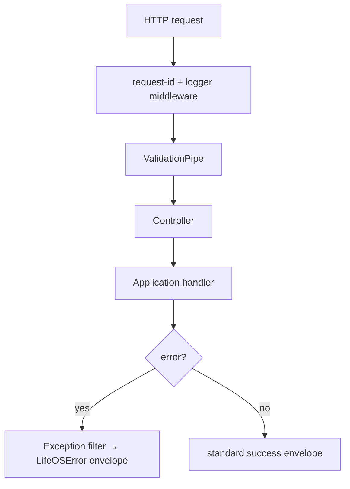
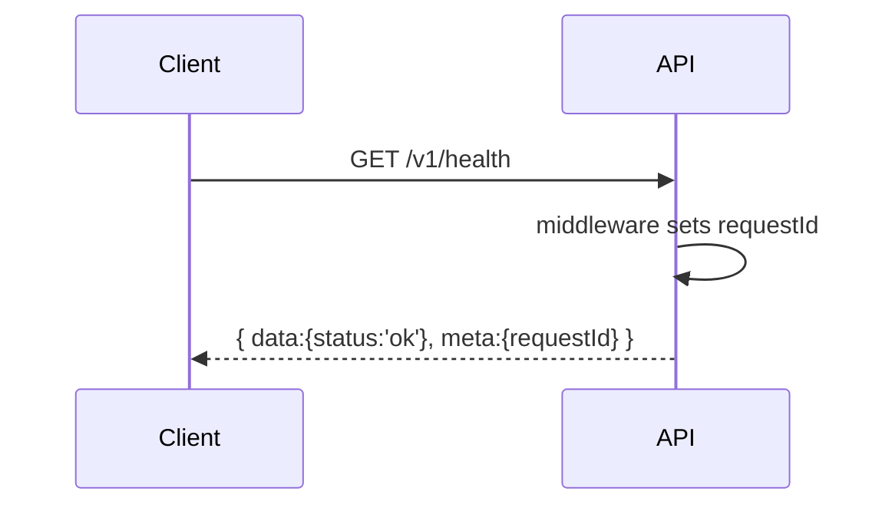

# Phase 02 — Backend Bootstrap (NestJS)

> Standards: [03 Handbook](../docs/03_LifeOS_Engineering_Handbook.md) · [10 API Standard](../docs/10_API_STANDARD.md) · Rules: [07](../docs/07_AI_AGENT_INSTRUCTIONS.md).

## 1. Overview
Stand up the NestJS application that *is* the LifeOS platform ([ADR-0001](../docs/adr/adr-0001-modular-monolith.md)). Establish the cross-cutting plumbing — config, logging, error handling, health, request context — that every module relies on. After this phase the API boots, exposes `/v1/health`, and returns the standard error envelope.

## 2. Objectives
- Bootable NestJS app in `apps/api` with versioned routing (`/v1`).
- Global pipeline: validation pipe, exception filter (→ `LifeOSError` envelope), request-id middleware, structured logger.
- Typed config via `@lifeos/config` (fail-fast on invalid env).
- `/v1/health` (liveness/readiness) and a module skeleton for hexagonal modules.

## 3. Requirements
- Global `ValidationPipe` (whitelist + transform) for DTOs ([10 §6](../docs/10_API_STANDARD.md)).
- Exception filter mapping any error → standard envelope with `requestId` ([10 §2](../docs/10_API_STANDARD.md)).
- `requestId` + (later) `turnId` propagated via async-local-storage context.
- Structured JSON logging with levels; no secrets/PII in logs ([11 §4](../docs/11_SECURITY_GUIDE.md)).
- Config schema validated at boot; the app refuses to start on invalid config.

## 4. Architecture


## 5. Folder structure
```
apps/api/src/
├── main.ts                       # bootstrap, global pipes/filters
├── app.module.ts
├── shared/
│   ├── http/                     # envelope helpers, exception filter
│   ├── context/                  # async-local-storage request context
│   ├── logging/
│   └── config/                   # bridges @lifeos/config
└── modules/
    └── health/                   # health module (sample hexagonal module)
```

## 6. Components
| Component | Purpose |
|-----------|---------|
| Exception filter | uniform `LifeOSError` envelope + status mapping ([10 §3](../docs/10_API_STANDARD.md)) |
| Validation pipe | DTO validation at the edge |
| Request context | `requestId`, user (later), `turnId` (later) |
| Logger | structured, redacting |
| Health module | liveness/readiness |
| Config bridge | typed, validated config |

## 7. Interfaces (added to `@lifeos/contracts`)
```ts
export interface ApiResponse<T> { data: T; meta: { requestId: string; timestamp: string }; }
export interface ApiError { error: { code: string; message: string; retryable: boolean; details?: unknown; requestId: string }; }
export class LifeOSError extends Error { code!: string; status!: number; retryable!: boolean; details?: unknown; }
```
These are **frozen** once merged — record in [06](../docs/06_PROJECT_STATE.md).

## 8. Diagrams


## 9. Examples
```http
GET /v1/health → 200
{ "data": { "status": "ok", "uptimeSec": 12 }, "meta": { "requestId": "req_01...", "timestamp": "..." } }
```
Error envelope (forced error route in test):
```json
{ "error": { "code": "INTERNAL", "message": "Unexpected error", "retryable": true, "requestId": "req_01..." } }
```

## 10. Tests
- E2E: `/v1/health` returns the success envelope with a `requestId`.
- E2E: a route that throws yields the standard error envelope + correct status.
- Unit: config loader rejects invalid env (fail-fast).
- Unit: logger redacts configured sensitive keys.

## 11. Acceptance Criteria
- [ ] API boots locally with one command.
- [ ] `/v1/health` returns success envelope.
- [ ] All errors return the `LifeOSError` envelope with `requestId`.
- [ ] Invalid config prevents boot.
- [ ] `ApiResponse`/`ApiError`/`LifeOSError` published in `@lifeos/contracts`.

## 12. Definition of Done
- [ ] Acceptance Criteria met; tests green at gate.
- [ ] Contracts versioned; [06](../docs/06_PROJECT_STATE.md) updated (contract version bump).
- [ ] No business logic introduced.

## 13. AI Coding Prompt
See [prompts/phase-02.md](../prompts/phase-02.md).

## 14. Future Improvements
- OpenAPI auto-generation ([10 §9](../docs/10_API_STANDARD.md)); tracing hooks (phase-33); rate-limit middleware (phase-28).

## 15. Known Risks
- Envelope/contract churn later → freeze carefully; changes need an ADR.
- Logging secrets by accident → redaction list + test.

## 16. Dependencies
Phase-01 (workspace, CI, config skeleton).

## 17. Review Checklist
- [ ] Versioned routing + global pipeline present.
- [ ] Envelopes match [10](../docs/10_API_STANDARD.md).
- [ ] Health module follows hexagonal shape ([module-template](../templates/module-template.md)).
- [ ] Contracts frozen + PROJECT_STATE updated.

## Future Extension Points
This bootstrap hosts every later module; the request context gains `userId` (phase-05) and `turnId` (phase-15) without structural change.
