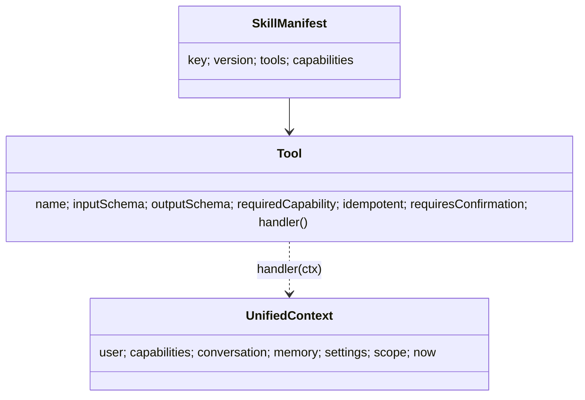

# Phase 03 — Platform Contracts (`@lifeos/contracts`)

> The public surface of the whole platform. Standards: [03](../docs/03_LifeOS_Engineering_Handbook.md) · [10 §1](../docs/10_API_STANDARD.md). This phase defines interfaces, not implementations.

## 1. Overview
Define the **frozen, versioned public interfaces** every plugin and module depends on. Getting these right is the highest-leverage work in the project: Skills, Tools, Connectors, and engines are all written against these types. Implementations come in later phases; here we publish the contracts and their contract tests.

## 2. Objectives
- Define core contracts: `Tool`, `UnifiedContext`, `SkillManifest`, `ProviderPort` base, `CapabilityKey`, `DomainEvent`, plus the API envelopes from phase-02.
- Establish **semver** policy and the "frozen contract" process ([06](../docs/06_PROJECT_STATE.md), [08 ADRs](../docs/08_ARCHITECTURE_DECISIONS.md)).
- Ship reusable **contract test suites** (`@lifeos/skill-sdk`/`@lifeos/provider-sdk` will consume these) for each interface.

## 3. Requirements
- Interfaces only — no NestJS/Supabase/OpenAI imports in `@lifeos/contracts`.
- JSON-schema types for tool I/O validation are first-class.
- Every interface has a contract test asserting its shape and any invariants.
- A documented compatibility policy: additive = minor, breaking = major + ADR.

## 4. Architecture
```mermaid
graph TD
    contracts[@lifeos/contracts] --> skillsdk[@lifeos/skill-sdk]
    contracts --> providersdk[@lifeos/provider-sdk]
    contracts --> api[apps/api]
    contracts --> skills
    contracts --> connectors
```
Everything depends on contracts; contracts depend on nothing. This is the inward-most ring of [ADR-0003](../docs/adr/adr-0003-hexagonal-ddd.md).

## 5. Folder structure
```
packages/contracts/src/
├── api/            # ApiResponse, ApiError, LifeOSError
├── tool/           # Tool<I,O>, JSONSchema, ToolResult
├── context/        # UnifiedContext, ContextProvider, ContextScope
├── skill/          # SkillManifest, capability declarations
├── provider/       # ProviderPort base, ProviderHealth
├── permission/     # CapabilityKey, PermissionDecision
├── event/          # DomainEvent, EventEnvelope
└── index.ts
packages/contracts/test/contract/   # reusable suites per interface
```

## 6. Components
The interface set listed under §7, plus the contract-test suites that any implementation must pass ([12 §2](../docs/12_TESTING_GUIDE.md)).

## 7. Interfaces (the frozen core)
```ts
export type CapabilityKey = `${string}.${string}`;     // 'grocery.order'

export interface Tool<I = unknown, O = unknown> {
  name: string;                       // '<skill>.<verb_noun>'
  inputSchema: JSONSchema;
  outputSchema: JSONSchema;
  requiredCapability: CapabilityKey;
  idempotent: boolean;
  requiresConfirmation: boolean;
  handler(ctx: UnifiedContext, args: I): Promise<O>;
}

export interface UnifiedContext {
  user: { id: string; locale: string; timezone: string };
  capabilities: CapabilityKey[];
  conversation: { id: string; recentTurns: Turn[] };
  memory: { facts: Fact[]; preferences: Preference[]; summaries: Summary[] };
  settings: Record<string, unknown>;
  scope: string;        // owning Skill key, for filtering
  now: string;          // ISO; no hidden clocks
}

export interface SkillManifest {
  key: string; version: string; contractVersion: string;
  capabilities: { key: CapabilityKey; description: string }[];
  tools: Tool[];
  contextProviders?: ContextProvider[];
  widgets?: WidgetContribution[];
  notifications?: NotificationDeclaration[];
  eventHandlers?: { event: string; handler: EventHandler }[];
  configSchema?: JSONSchema;
}

export interface DomainEvent<P = unknown> {
  eventId: string; type: string; userId?: string;
  occurredAt: string; payload: P;
}
```

## 8. Diagrams


## 9. Examples
A fake tool used in tests:
```ts
export const echoTool: Tool<{ text: string }, { text: string }> = {
  name: 'test.echo', inputSchema, outputSchema,
  requiredCapability: 'test.use', idempotent: true, requiresConfirmation: false,
  async handler(_ctx, args) { return { text: args.text }; },
};
```

## 10. Tests
- Contract suite per interface (shape, required fields, naming rules for tool/capability/event).
- A negative test: an invalid `SkillManifest` (bad tool name, missing capability) fails validation.
- Semver lint: a breaking change to a frozen type fails CI unless an ADR + major bump accompanies it.

## 11. Acceptance Criteria
- [ ] All core interfaces published and documented.
- [ ] Reusable contract test suites exist and pass.
- [ ] Compatibility policy documented; CI guard for breaking changes.
- [ ] `@lifeos/contracts` imports no framework.

## 12. Definition of Done
- [ ] Interfaces frozen and listed in [06 PROJECT_STATE](../docs/06_PROJECT_STATE.md) with contract version (e.g. `0.1.0`).
- [ ] Tests green; docs ([02](../docs/02_LifeOS_Platform_Architecture.md)/[14](../docs/14_GLOSSARY.md)) cross-reference the types.

## 13. AI Coding Prompt
See [prompts/phase-03.md](../prompts/phase-03.md).

## 14. Future Improvements
- Generate OpenAPI/JSON-schema artifacts from these types.
- Contract-test versioning so plugins record which version they passed ([12](../docs/12_TESTING_GUIDE.md)).

## 15. Known Risks
- **Premature freezing** of a wrong shape is costly → invest in review; keep the set minimal and additive-friendly.
- Over-engineering interfaces before a consumer exists → define only what phases 04–11 need.

## 16. Dependencies
Phase-02 (envelopes/`LifeOSError`).

## 17. Review Checklist
- [ ] No framework imports.
- [ ] Naming rules enforced for tools/capabilities/events.
- [ ] Contract tests cover every interface.
- [ ] Frozen list + version in PROJECT_STATE.

## Future Extension Points
New contracts (e.g. `ProviderPort` per domain, marketplace manifest fields) are added here additively; breaking changes always pair with an ADR.
