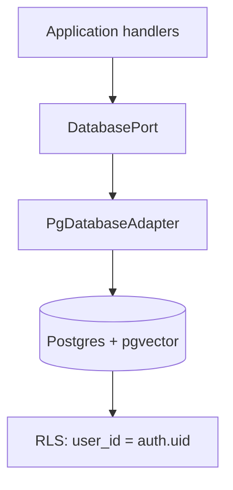
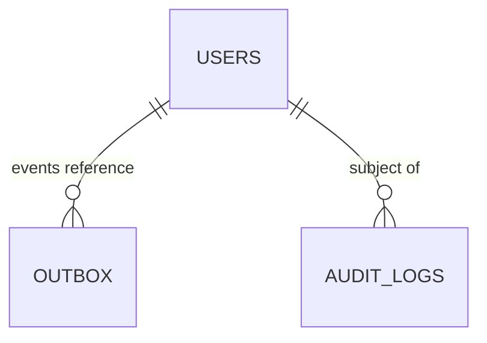

# Phase 04 — Database Foundation + RLS

> Spec: [09 Database Design](../docs/09_DATABASE_DESIGN.md) · [ADR-0010](../docs/adr/adr-0010-supabase-baas.md). Template: [database-template](../templates/database-template.md).

## 1. Overview
Provision Postgres (Supabase) and establish the data foundation: schema namespacing, the migration system, base tables (`platform.users`, `platform.outbox`, `platform.audit_logs`), the `DatabasePort`/repository pattern, RLS, and pgvector enablement. After this phase the app can persist and read user-scoped data safely.

## 2. Objectives
- Migration runner (forward-only, numbered) + first migrations.
- Schema-per-domain namespacing ([09 §1](../docs/09_DATABASE_DESIGN.md)).
- `platform.users`, `platform.outbox`, `platform.audit_logs`; `updated_at` trigger; UUIDv7.
- `DatabasePort` abstraction + a Postgres adapter ([ADR-0010](../docs/adr/adr-0010-supabase-baas.md): Supabase behind a port).
- RLS policy pattern; enable `vector` extension for later memory work.

## 3. Requirements
- All user-owned tables have RLS owner policies ([09 §4](../docs/09_DATABASE_DESIGN.md)).
- Migrations reviewed, numbered, reversible-by-new-migration.
- No domain code imports Supabase — only `adapters/out` via `DatabasePort`.
- Testcontainers Postgres (with pgvector) for integration tests.

## 4. Architecture


## 5. Folder structure
```
apps/api/src/shared/database/
├── database.port.ts
├── pg-database.adapter.ts        # the ONLY place Supabase/pg is touched
└── transaction.ts                # txn helper (used by outbox writes)
migrations/
├── 0001_init_schemas.sql
├── 0002_users.sql
├── 0003_outbox.sql
├── 0004_audit_logs.sql
└── 0005_enable_pgvector.sql
```

## 6. Components
| Component | Purpose |
|-----------|---------|
| Migration runner | ordered, forward-only |
| `DatabasePort` | query/transaction abstraction |
| Pg adapter | Supabase/pg implementation |
| RLS policies | tenant isolation |
| Outbox table | event reliability ([ADR-0008](../docs/adr/adr-0008-event-driven-outbox.md)) — consumed in phase-06 |

## 7. Interfaces (`@lifeos/contracts` / shared)
```ts
export interface DatabasePort {
  queryOne<T>(table: string, where: Record<string, unknown>): Promise<T | null>;
  transaction<T>(fn: (tx: Tx) => Promise<T>): Promise<T>;
}
export interface Tx { insert(table: string, row: object): Promise<void>; upsert(table: string, row: object): Promise<void>; /* ... */ }
```

## 8. Diagrams


## 9. Examples
RLS policy (from [database-template](../templates/database-template.md)):
```sql
alter table platform.users enable row level security;
create policy users_self on platform.users using (id = auth.uid());
```

## 10. Tests
- Integration: migrations apply cleanly on a fresh DB (testcontainers).
- RLS test: a query as user A cannot read user B's rows.
- Transaction test: a failed txn rolls back state **and** the outbox row together.
- `DatabasePort` adapter unit/integration tests.

## 11. Acceptance Criteria
- [ ] Migrations run forward cleanly; DB version = `0005`.
- [ ] `platform.users/outbox/audit_logs` exist with correct columns/constraints.
- [ ] RLS proven by a cross-user denial test.
- [ ] pgvector enabled.
- [ ] No Supabase import outside `adapters/out`.

## 12. Definition of Done
- [ ] Acceptance Criteria met; tests green.
- [ ] [09](../docs/09_DATABASE_DESIGN.md) catalog updated; **Database version `0005`** in [06](../docs/06_PROJECT_STATE.md).

## 13. AI Coding Prompt
See [prompts/phase-04.md](../prompts/phase-04.md).

## 14. Future Improvements
- Partitioning for high-volume tables; read replicas; CDC to warehouse (phase-33).

## 15. Known Risks
- **RLS misconfiguration = data leak** → mandatory cross-user denial tests; defense-in-depth with Permission Engine (phase-07).
- Supabase coupling creep → enforce the port boundary in review/lint.

## 16. Dependencies
Phase-02 (config, app shell).

## 17. Review Checklist
- [ ] Every user-owned table has an RLS owner policy.
- [ ] Migrations numbered/forward-only; outbox + audit append-only.
- [ ] DatabasePort is the sole DB boundary.
- [ ] DB version bumped in PROJECT_STATE.

## Future Extension Points
The schema-per-domain layout lets a context's schema (e.g. `memory.*`) move to a separate database during service extraction with minimal change ([13 §6](../docs/13_DEPLOYMENT_GUIDE.md)).
