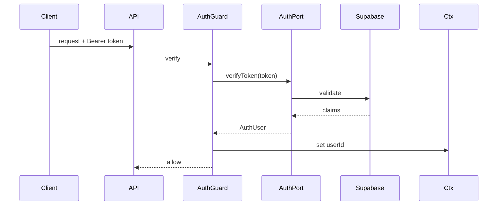
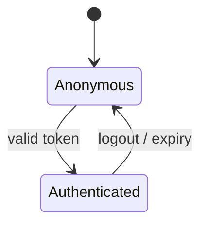

# Phase 05 — Identity & Auth

> Spec: [11 Security](../docs/11_SECURITY_GUIDE.md) · [ADR-0010](../docs/adr/adr-0010-supabase-baas.md) (Auth behind `AuthPort`).

## 1. Overview
Integrate Supabase Auth behind an `AuthPort`, establish sessions and the authenticated request context, and provide a `@CurrentUser()` decorator + auth guard. This is the identity substrate every capability check (phase-07) and user-scoped query builds on. After this phase, requests are authenticated and `userId` flows through the request context.

## 2. Objectives
- `AuthPort` + Supabase adapter (verify token → `AuthUser`).
- Auth guard + `@CurrentUser()`; `userId` injected into request context (from phase-02).
- `platform.users` provisioning/sync on first login.
- `/v1/auth/session` and `/v1/me` (returns user; capabilities added in phase-07).

## 3. Requirements
- Token verification behind `AuthPort` — no Supabase auth calls in domain/application ([ADR-0010](../docs/adr/adr-0010-supabase-baas.md)).
- `auth.uid()` (RLS) and app-level `userId` must agree.
- Short-lived access tokens; refresh handled by client/Supabase; revocation on logout.
- No secrets/PII in logs ([11 §4](../docs/11_SECURITY_GUIDE.md)).

## 4. Architecture


## 5. Folder structure
```
apps/api/src/modules/identity/
├── domain/ports/auth.port.ts
├── application/services/ (provision-user, get-me)
├── adapters/
│   ├── in/ (auth.guard.ts, current-user.decorator.ts, identity.controller.ts)
│   └── out/ (supabase-auth.adapter.ts, user.repository.ts)
└── identity.module.ts
```

## 6. Components
| Component | Purpose |
|-----------|---------|
| `AuthPort` + adapter | verify tokens, map to `AuthUser` |
| Auth guard | protect routes |
| `@CurrentUser()` | inject identity |
| User provisioning | sync auth user → `platform.users` |
| `/v1/me` | current user |

## 7. Interfaces
```ts
export interface AuthUser { id: string; email: string; }
export interface AuthPort { verifyToken(token: string): Promise<AuthUser>; }
```

## 8. Diagrams


## 9. Examples
```http
GET /v1/me  (Bearer token)
→ { "data": { "id": "usr_...", "email": "a@b.com", "locale": "en-IN", "timezone": "Asia/Kolkata" }, "meta": {...} }
```

## 10. Tests
- E2E: protected route rejects missing/invalid token (401); accepts valid.
- Integration: first login provisions a `platform.users` row; `auth.uid()` matches app `userId`.
- Unit: `AuthPort` adapter maps claims → `AuthUser`.

## 11. Acceptance Criteria
- [ ] Authenticated requests carry `userId` in request context.
- [ ] `/v1/auth/session` + `/v1/me` work.
- [ ] First login provisions the user; RLS uses the same id.
- [ ] No Supabase auth call outside the adapter.

## 12. Definition of Done
- [ ] Acceptance Criteria met; tests green.
- [ ] `AuthUser`/`AuthPort` in contracts; [06](../docs/06_PROJECT_STATE.md) updated.

## 13. AI Coding Prompt
See [prompts/phase-05.md](../prompts/phase-05.md).

## 14. Future Improvements
- OAuth/social providers; org/family principals (reuse capability model, [ADR-0006](../docs/adr/adr-0006-capability-permissions.md)); session anomaly detection ([11](../docs/11_SECURITY_GUIDE.md)).

## 15. Known Risks
- Mismatch between `auth.uid()` and app `userId` → integration test asserts equality.
- Token handling mistakes → keep all of it in the adapter + guard; cover with E2E.

## 16. Dependencies
Phase-03 (contracts), phase-04 (users table, RLS).

## 17. Review Checklist
- [ ] Auth confined to adapter + guard.
- [ ] `userId` in context; RLS alignment tested.
- [ ] No secrets logged.
- [ ] PROJECT_STATE updated.

## Future Extension Points
The `AuthPort` makes swapping Supabase Auth for another provider an adapter change ([13 §7](../docs/13_DEPLOYMENT_GUIDE.md)); principals generalize to families/orgs.
