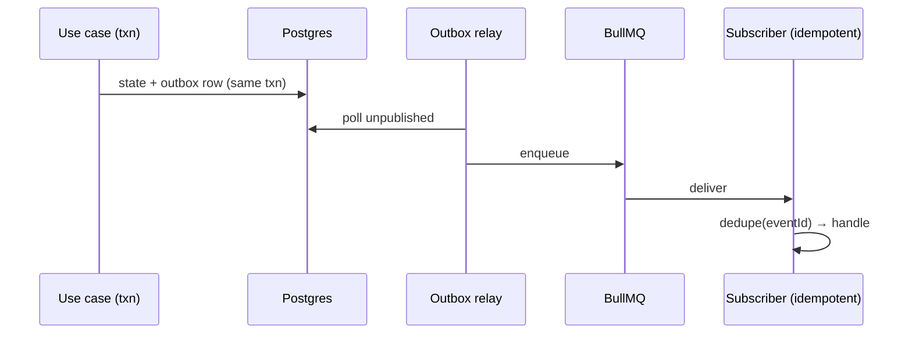
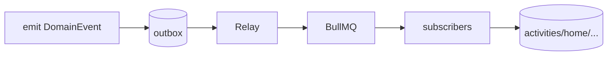

# Phase 06 — Event Bus + Outbox + BullMQ

> Spec: [ADR-0008](../docs/adr/adr-0008-event-driven-outbox.md) · [02 §14](../docs/02_LifeOS_Platform_Architecture.md) · [09 outbox](../docs/09_DATABASE_DESIGN.md).

## 1. Overview
Build the reliable event backbone: domain events written to the `outbox` in the same transaction as state, a relay that publishes to BullMQ, and idempotent subscriber infrastructure. This decouples Skills/engines forever ([ADR-0001](../docs/adr/adr-0001-modular-monolith.md)) and underpins activities, notifications, home read models, and cross-Skill cooperation. After this phase, emitting an event reliably reaches subscribers exactly-as-intended.

## 2. Objectives
- `EventBusPort` (publish) writing outbox rows transactionally.
- Outbox **relay** worker → BullMQ.
- Subscriber registration + **idempotent** handler wrapper (dedupe by `eventId`).
- Redis + BullMQ wiring; a dead-letter queue and retry/backoff policy.

## 3. Requirements
- Publishing an event and changing state happen in **one transaction** (no dual-write).
- Delivery is at-least-once; handlers must be idempotent (enforced by a dedupe store).
- Failed jobs retry with backoff, then dead-letter; observable.
- Event types and payloads typed via `DomainEvent` from contracts (phase-03).

## 4. Architecture


## 5. Folder structure
```
apps/api/src/shared/events/
├── event-bus.port.ts
├── outbox/ (relay.worker.ts, outbox.repository.ts)
├── subscribers/ (registry.ts, idempotent-handler.ts, dedupe.store.ts)
└── bullmq/ (queues.ts, dead-letter.ts)
```

## 6. Components
| Component | Purpose |
|-----------|---------|
| `EventBusPort` | transactional publish via outbox |
| Outbox relay | move rows → queue |
| Subscriber registry | route events → handlers |
| Idempotent wrapper | dedupe at-least-once delivery |
| DLQ + retry | reliability/observability |

## 7. Interfaces
```ts
export interface EventBusPort { publish(events: DomainEvent[], tx?: Tx): Promise<void>; }
export interface EventHandler<P = unknown> { (event: DomainEvent<P>): Promise<void>; }
export interface SubscriberRegistry { on(type: string, handler: EventHandler): void; }
```

## 8. Diagrams


## 9. Examples
```ts
await db.transaction(async (tx) => {
  await orders.save(order, tx);
  await eventBus.publish([{ eventId, type: 'grocery.order_placed', userId, occurredAt, payload }], tx);
});
```

## 10. Tests
- Integration: state+outbox commit/rollback atomicity.
- Integration: relay delivers; subscriber runs.
- Idempotency: replaying an event triggers the handler's effect once.
- Failure: handler error → retry → DLQ.

## 11. Acceptance Criteria
- [ ] Events publish transactionally via outbox.
- [ ] Relay delivers to BullMQ; subscribers receive.
- [ ] Duplicate delivery produces a single effect.
- [ ] Failures retry and dead-letter.

## 12. Definition of Done
- [ ] Acceptance Criteria met; tests green.
- [ ] `EventBusPort`/`EventHandler` in contracts; [06](../docs/06_PROJECT_STATE.md) updated.

## 13. AI Coding Prompt
See [prompts/phase-06.md](../prompts/phase-06.md).

## 14. Future Improvements
- Event schema registry/versioning; CDC; cross-service transport after extraction ([13 §6](../docs/13_DEPLOYMENT_GUIDE.md)).

## 15. Known Risks
- **Non-idempotent handlers** cause duplicate effects → idempotent wrapper is mandatory, with a test.
- Relay lag → monitor outbox backlog; tune poll interval/batch.

## 16. Dependencies
Phase-03 (DomainEvent), phase-04 (outbox table, transactions).

## 17. Review Checklist
- [ ] No publish outside a transaction with its state change.
- [ ] Every subscriber idempotent (dedupe tested).
- [ ] DLQ + retry present and observable.
- [ ] PROJECT_STATE updated.

## Future Extension Points
This bus is the inter-service contract post-extraction; activities (19), notifications (20), and home (21) are its first consumers.
