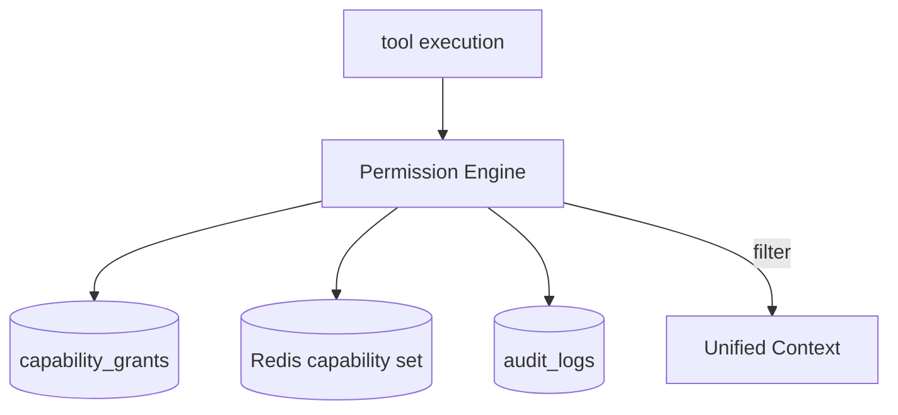
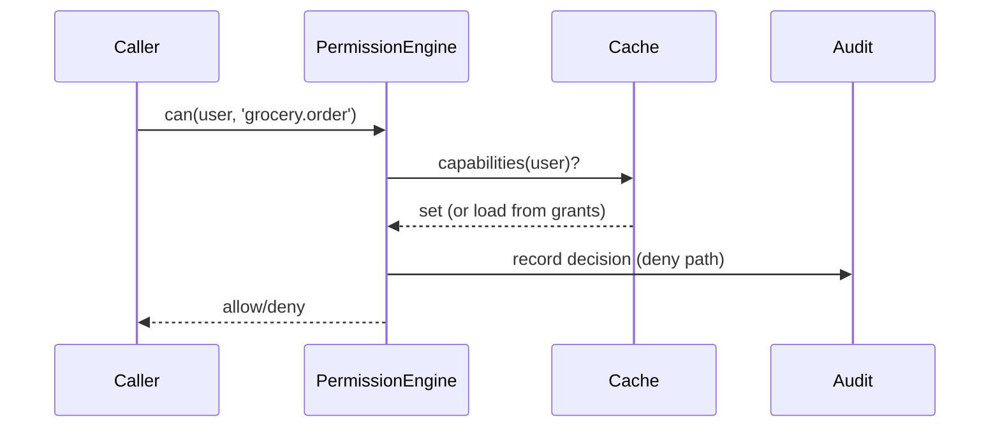

# Phase 07 — Permission Engine

> Spec: [ADR-0006](../docs/adr/adr-0006-capability-permissions.md) · [02 §13](../docs/02_LifeOS_Platform_Architecture.md) · [11 §2](../docs/11_SECURITY_GUIDE.md). Built **before** subscriptions — capabilities exist before anything sells them.

## 1. Overview
Implement capability-based authorization: the engine that answers *"does this user, in this context, hold the capability this tool requires?"* and that **filters Unified Context** by permission. It is the first of the three defense-in-depth layers ([11 §2](../docs/11_SECURITY_GUIDE.md)) and the gate every tool execution passes through. After this phase, capability checks are enforceable platform-wide.

## 2. Objectives
- Capability taxonomy + storage (`catalog.capabilities`, `billing.capability_grants` — grants source-agnostic).
- `PermissionPort`: `can(userId, capability, scope)` → decision; `capabilitiesFor(userId)`.
- Context filtering hook the Context Engine (phase-13) will call.
- Caching (Redis) of a user's capability set with invalidation on grant change.

## 3. Requirements
- Grants come from any source (subscription/trial/admin/bundle) uniformly ([ADR-0006](../docs/adr/adr-0006-capability-permissions.md)); the engine doesn't know about billing.
- Deny-by-default; explicit allow only.
- Decisions and denials are auditable ([11 §7](../docs/11_SECURITY_GUIDE.md)).
- Capability keys validated against the taxonomy.

## 4. Architecture


## 5. Folder structure
```
apps/api/src/modules/permission/
├── domain/ (capability.vo.ts, permission-decision.vo.ts, ports/permission.port.ts)
├── application/ (check-capability.query.ts, capabilities-for-user.query.ts, filter-context.service.ts)
├── adapters/out/ (grants.repository.ts, capability-cache.ts)
└── permission.module.ts
migrations/ 0006_capabilities.sql 0007_capability_grants.sql
```

## 6. Components
| Component | Purpose |
|-----------|---------|
| Capability taxonomy | the access vocabulary |
| `PermissionPort` | `can()` / `capabilitiesFor()` |
| Context filter | strips data the user can't access |
| Capability cache | hot-path performance |
| Audit hook | record denials/grants |

## 7. Interfaces
```ts
export interface PermissionDecision { allow: boolean; reason?: string; }
export interface PermissionPort {
  can(userId: string, capability: CapabilityKey, scope?: string): Promise<PermissionDecision>;
  capabilitiesFor(userId: string): Promise<CapabilityKey[]>;
}
```

## 8. Diagrams


## 9. Examples
```ts
const d = await permissions.can(user.id, 'grocery.order');
if (!d.allow) throw new LifeOSError({ code: 'PERMISSION_DENIED', status: 403, details: { requiredCapability: 'grocery.order' } });
```

## 10. Tests
- Unit: deny-by-default; allow only with a grant; expired grant denies.
- Integration: grant change invalidates cache.
- Context filtering: a user without a capability cannot see scoped data.
- Audit: denials are recorded.

## 11. Acceptance Criteria
- [ ] `can()` returns correct allow/deny incl. expiry.
- [ ] `capabilitiesFor()` aggregates all grant sources.
- [ ] Context filtering removes unauthorized data.
- [ ] Denials audited; cache invalidates on change.

## 12. Definition of Done
- [ ] Acceptance Criteria met; tests green.
- [ ] `PermissionPort` in contracts; [06](../docs/06_PROJECT_STATE.md) updated; migrations to DB version `0007`.

## 13. AI Coding Prompt
See [prompts/phase-07.md](../prompts/phase-07.md).

## 14. Future Improvements
- Attribute/row-level conditions; delegated grants (family/org); policy explainability in the Dev Console.

## 15. Known Risks
- **Engine is on the hot path** → cache, but correctness > speed; defense-in-depth with RLS means a cache bug can't leak data.
- Taxonomy sprawl → own the capability list alongside contracts.

## 16. Dependencies
Phase-03 (CapabilityKey), 04 (tables/RLS), 05 (identity).

## 17. Review Checklist
- [ ] Deny-by-default; expiry honored.
- [ ] Grants source-agnostic (no billing coupling).
- [ ] Context filter + audit present.
- [ ] PROJECT_STATE + DB version updated.

## Future Extension Points
The same `can()` check gates marketplace Skills; grants extend to org principals without engine change.
