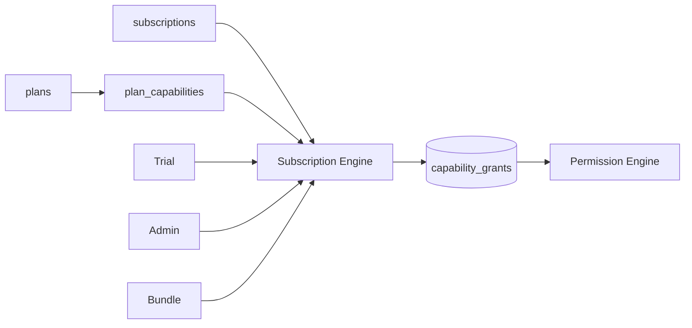
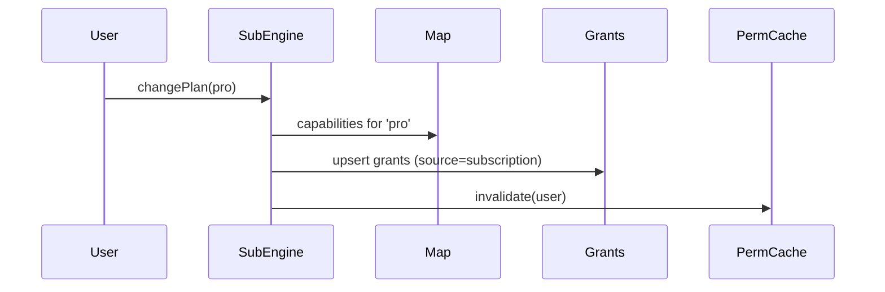

# Phase 08 — Subscription Engine

> Spec: [ADR-0006](../docs/adr/adr-0006-capability-permissions.md) · [02 §13](../docs/02_LifeOS_Platform_Architecture.md). **Subscriptions grant capabilities; they never unlock Skills.**

## 1. Overview
Map plans → capabilities, so monetization is configuration, not code. The engine turns billing state (plans, trials, bundles) into **capability grants** consumed by the Permission Engine (phase-07). After this phase, changing a plan's contents is a data change in `billing.plan_capabilities` with no Skill code touched.

## 2. Objectives
- `billing.plans` + `billing.plan_capabilities` (the data-driven map) + `billing.subscriptions`.
- On subscription change, materialize/refresh `capability_grants` (source = `subscription`).
- Trials, bundles, and admin grants as additional grant sources.
- A clean seam for a payment provider (out of scope to integrate a real PSP here; behind a `BillingPort`).

## 3. Requirements
- Subscriptions reference **capabilities**, never Skills ([ADR-0006](../docs/adr/adr-0006-capability-permissions.md)).
- Grant changes invalidate the Permission Engine cache (phase-07).
- Plan→capability map is configuration/data; adding a plan or moving a capability is no-code.
- Idempotent grant materialization (driven by billing events).

## 4. Architecture


## 5. Folder structure
```
apps/api/src/modules/subscription/
├── domain/ (plan.entity.ts, subscription.entity.ts, ports/billing.port.ts)
├── application/ (materialize-grants.service.ts, change-subscription.command.ts)
├── adapters/out/ (plans.repository.ts, subscriptions.repository.ts)
└── subscription.module.ts
migrations/ 0008_plans.sql 0009_plan_capabilities.sql 0010_subscriptions.sql
```

## 6. Components
| Component | Purpose |
|-----------|---------|
| Plan + map | data-driven plan→capabilities |
| Grant materializer | subscription/trial → capability_grants |
| `BillingPort` | PSP seam (stub now) |
| Event reactions | billing events → grant refresh |

## 7. Interfaces
```ts
export interface BillingPort { /* PSP seam — stubbed */ getStatus(userId: string): Promise<BillingStatus>; }
export interface SubscriptionService {
  changePlan(userId: string, planId: string): Promise<void>;     // refreshes grants
  startTrial(userId: string, capabilities: CapabilityKey[], expiresAt: string): Promise<void>;
}
```

## 8. Diagrams


## 9. Examples
`plan_capabilities` (data, not code):
```
plan_id   capability_key
pro       grocery.order
pro       ai.advanced_planning
pro       memory.unlimited
```

## 10. Tests
- Unit: plan change recomputes the correct grant set.
- Integration: grant change invalidates Permission cache; `can()` reflects it.
- Trial expiry removes capabilities.
- Idempotency of grant materialization on repeated billing events.

## 11. Acceptance Criteria
- [ ] Plans map to capabilities via data.
- [ ] Subscription/trial changes update grants and propagate to permissions.
- [ ] No Skill code references plans/subscriptions.
- [ ] Trials/admin/bundle sources work uniformly.

## 12. Definition of Done
- [ ] Acceptance Criteria met; tests green.
- [ ] [06](../docs/06_PROJECT_STATE.md) updated; DB version `0010`.

## 13. AI Coding Prompt
See [prompts/phase-08.md](../prompts/phase-08.md).

## 14. Future Improvements
- Integrate a real PSP behind `BillingPort`; proration; usage-based capabilities; partner bundle automation.

## 15. Known Risks
- Temptation to gate Skills directly → forbidden; review enforces the capability indirection.
- Grant/permission cache drift → integration test the invalidation path.

## 16. Dependencies
Phase-07 (capabilities, grants, permission cache).

## 17. Review Checklist
- [ ] Plans reference capabilities only.
- [ ] Grant materialization idempotent; cache invalidation tested.
- [ ] PROJECT_STATE + DB version updated.

## Future Extension Points
The `BillingPort` lets a real payment provider drop in later; the capability model already supports family/org and à-la-carte purchases.
