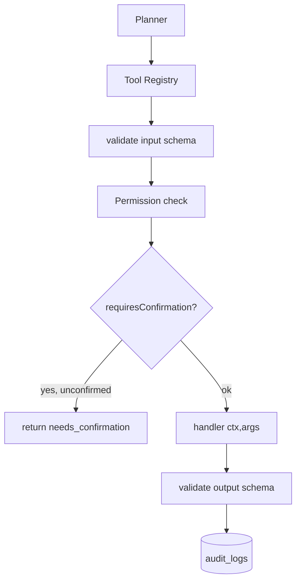
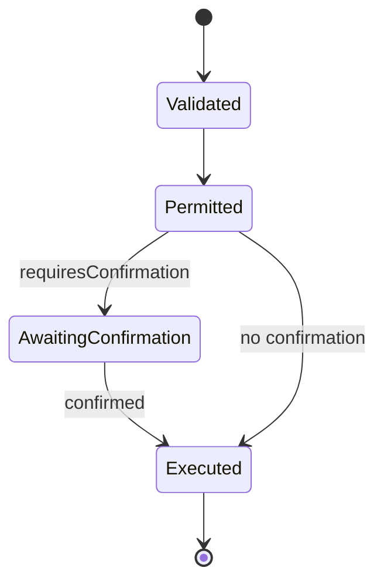

# Phase 09 — Tool Registry

> Spec: [02 §11](../docs/02_LifeOS_Platform_Architecture.md) · [ADR-0004](../docs/adr/adr-0004-ai-no-business-logic.md) · [11 §2](../docs/11_SECURITY_GUIDE.md). The safety boundary between a probabilistic Planner and deterministic execution.

## 1. Overview
Build the registry that holds tools, validates their inputs/outputs against JSON schemas, enforces capability checks and confirmation, and executes them. The Planner (phase-17) sees **tools**, never Skills. This is the first framework-band phase — it lets *anything* expose callable capability. After this phase, a tool can be registered and executed safely with full validation + permission + audit.

## 2. Objectives
- `ToolRegistry`: register, lookup, list (capability-filtered), execute.
- Pre-execution input-schema validation; post-execution output-schema validation.
- Capability gate (via Permission Engine, phase-07) + `requiresConfirmation` handling.
- Audit every execution ([11 §7](../docs/11_SECURITY_GUIDE.md)); idempotency support for safe retries.

## 3. Requirements
- A tool with invalid args **never executes** (reject with `TOOL_INPUT_INVALID`).
- Every execution checks `requiredCapability` before running.
- Consequential tools (`requiresConfirmation`) require an explicit confirmation token.
- Execution is observable (timing, errors) and audited.

## 4. Architecture


## 5. Folder structure
```
apps/api/src/modules/tool-registry/
├── domain/ (tool-descriptor.ts, ports/tool-registry.port.ts)
├── application/ (register-tool.service.ts, execute-tool.service.ts, list-tools.query.ts)
├── adapters/ (in/tool.controller.ts [console], out/tool.repository.ts)
└── tool-registry.module.ts
```

## 6. Components
| Component | Purpose |
|-----------|---------|
| Registry | hold/lookup/list tools |
| Validator | JSON-schema I/O validation |
| Executor | permission + confirmation + run + audit |
| Persistence | `catalog.tools` mirror for console |

## 7. Interfaces
```ts
export interface ToolExecutionResult<O = unknown> {
  status: 'ok' | 'needs_confirmation' | 'error';
  output?: O; error?: LifeOSError; confirmationToken?: string;
}
export interface ToolRegistryPort {
  register(tool: Tool): void;
  list(ctx: UnifiedContext): Tool[];                 // capability-filtered
  execute(name: string, ctx: UnifiedContext, args: unknown, opts?: { confirmationToken?: string }): Promise<ToolExecutionResult>;
}
```

## 8. Diagrams


## 9. Examples
```ts
const res = await tools.execute('grocery.build_cart', ctx, { strategy: 'usual' });
if (res.status === 'needs_confirmation') { /* surface confirmation to user */ }
```

## 10. Tests
- Unit: invalid input rejected pre-execution; invalid output flagged.
- Unit: missing capability → denied (no handler call).
- Unit: `requiresConfirmation` halts then proceeds with a valid token.
- Integration: execution audited; idempotent re-execution safe.

## 11. Acceptance Criteria
- [ ] Tools register and list (capability-filtered).
- [ ] Bad input never reaches the handler.
- [ ] Capability + confirmation enforced.
- [ ] Executions audited.

## 12. Definition of Done
- [ ] Acceptance Criteria met; tests green.
- [ ] `ToolRegistryPort`/`ToolExecutionResult` in contracts; [06](../docs/06_PROJECT_STATE.md) updated.

## 13. AI Coding Prompt
See [prompts/phase-09.md](../prompts/phase-09.md).

## 14. Future Improvements
- Parallel execution by plan dependency graph (phase-18); tool versioning; rate/cost limits per tool.

## 15. Known Risks
- **Skipping validation** = the injection safety net fails → validation is mandatory and tested both ways.
- Confirmation bypass → token required + tested.

## 16. Dependencies
Phase-03 (Tool/contracts), phase-07 (permissions).

## 17. Review Checklist
- [ ] Input+output validated; handler never sees bad input.
- [ ] Capability + confirmation enforced; audited.
- [ ] No Skill imported by the registry.
- [ ] PROJECT_STATE updated.

## Future Extension Points
The registry executes tools from any Skill (registered via the Skill Registry, phase-10) and from future marketplace Skills under the same validation/permission guarantees.
