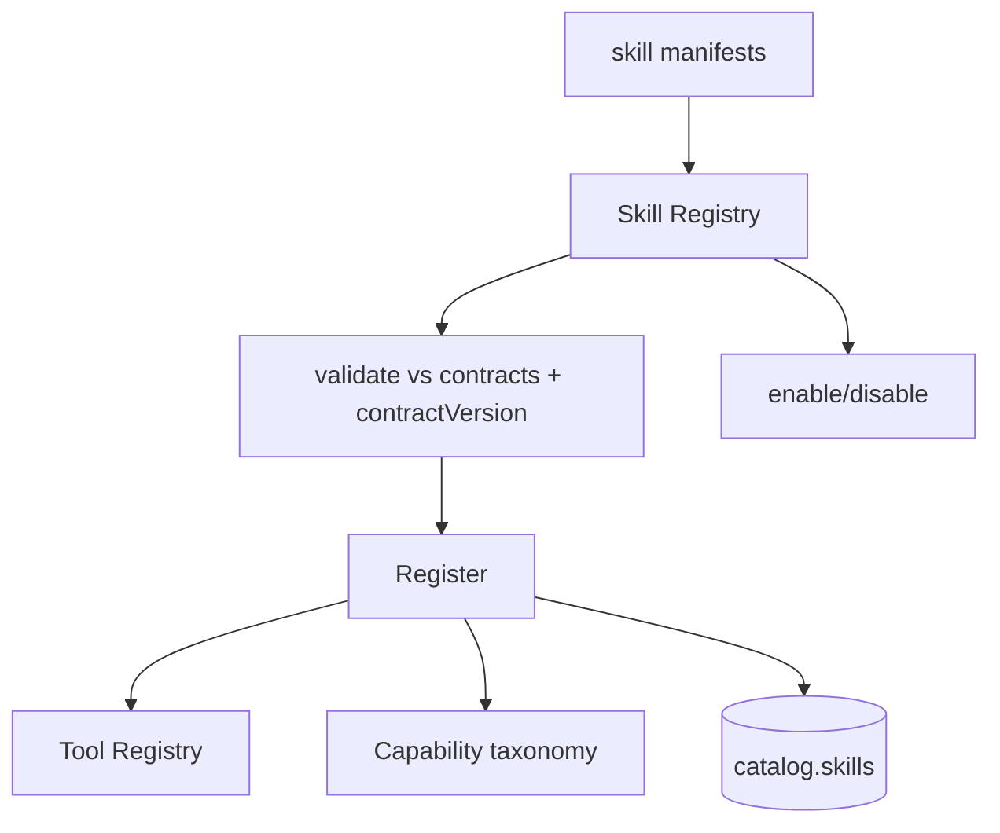
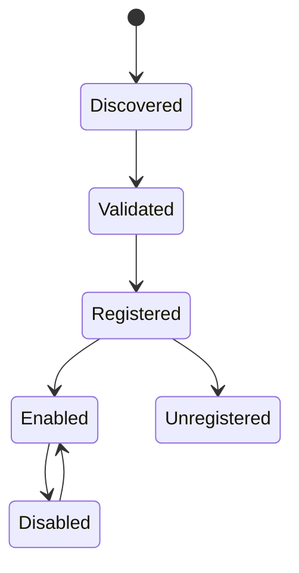

# Phase 10 — Skill Registry & Skill SDK

> Spec: [02 §10](../docs/02_LifeOS_Platform_Architecture.md) · [ADR-0001](../docs/adr/adr-0001-modular-monolith.md). Templates: [skill-template](../templates/skill-template.md). This is the heart of the plugin platform.

## 1. Overview
Build the registry that discovers and registers Skills **from manifests** (the core never imports a Skill), plus the `@lifeos/skill-sdk` that developers use to build Skills (base classes, manifest helpers, the contract-test kit). After this phase, a Skill package can register and have its tools appear in the Tool Registry — the moment LifeOS becomes a platform, not an app.

## 2. Objectives
- `SkillRegistry`: discover → validate → register → enable/disable; lifecycle + versioning.
- Manifest validation against contracts (phase-03), incl. `contractVersion` compatibility check.
- On register: forward the Skill's tools to the Tool Registry (phase-09), capabilities to the taxonomy, and (later) widgets/activities/notifications to their engines.
- `@lifeos/skill-sdk`: `defineSkill`, base context-provider/tool helpers, `runSkillContractTests`.
- `catalog.skills` persistence + per-user enable/disable hook (capability-gated).

## 3. Requirements
- The core **does not import** any Skill; it loads manifests (config-driven discovery).
- A Skill targeting an incompatible `contractVersion` is **refused** ([02 §10](../docs/02_LifeOS_Platform_Architecture.md), semver in [10 §1](../docs/10_API_STANDARD.md)).
- Skills cannot import other Skills (lint rule from phase-01 covers this).
- A demo/sample Skill (no real domain) proves registration end-to-end.

## 4. Architecture


## 5. Folder structure
```
packages/skill-sdk/src/ (define-skill.ts, base-tool.ts, base-context-provider.ts, testing/run-skill-contract-tests.ts)
apps/api/src/modules/skill-registry/
├── domain/ (skill-descriptor.ts, lifecycle.ts, ports/skill-registry.port.ts)
├── application/ (register-skill.service.ts, validate-manifest.service.ts, toggle-skill.command.ts)
├── adapters/ (in/skill.controller.ts [console], out/skills.repository.ts)
└── skill-registry.module.ts
migrations/ 0011_skills.sql
skills/sample/ (a trivial demo Skill)
```

## 6. Components
| Component | Purpose |
|-----------|---------|
| Skill Registry | discover/validate/register/lifecycle |
| Manifest validator | shape + contractVersion compat |
| SDK (`defineSkill`, helpers) | build Skills consistently |
| Contract-test kit | `runSkillContractTests` |
| Persistence | `catalog.skills`, enable/disable |

## 7. Interfaces
```ts
export interface SkillRegistryPort {
  register(manifest: SkillManifest): void;        // validates, wires tools/caps
  list(): SkillDescriptor[];
  setEnabled(userId: string, key: string, enabled: boolean): Promise<void>;
}
// SDK
export function defineSkill(manifest: SkillManifest): SkillManifest;
export function runSkillContractTests(manifest: SkillManifest): void;  // used in Skill test suites
```

## 8. Diagrams


## 9. Examples
The sample Skill manifest (proves the path) registers one `sample.echo` tool requiring `sample.use`; after boot it appears in `tools.list(ctx)` for a user holding `sample.use`.

## 10. Tests
- Unit: invalid manifest rejected; incompatible `contractVersion` refused.
- Integration: registering the sample Skill exposes its tool via the Tool Registry.
- `runSkillContractTests(sample)` passes.
- Lifecycle: enable/disable toggles tool availability per user.

## 11. Acceptance Criteria
- [ ] Skills register from manifests; core imports none of them.
- [ ] Incompatible contract versions refused.
- [ ] Sample Skill's tool executes through the Tool Registry.
- [ ] Enable/disable works and is capability-aware.

## 12. Definition of Done
- [ ] Acceptance Criteria met; tests green.
- [ ] `SkillRegistryPort` + SDK published; [06](../docs/06_PROJECT_STATE.md) updated; DB version `0011`.

## 13. AI Coding Prompt
See [prompts/phase-10.md](../prompts/phase-10.md).

## 14. Future Improvements
- Marketplace: signing, sandboxing, capability allowlists; hot-reload of Skills; Skill dependency declarations.

## 15. Known Risks
- **Core→Skill coupling creep** → lint rule + review; manifests only.
- Manifest/contract drift → contract tests + version check.

## 16. Dependencies
Phase-03 (SkillManifest), phase-09 (Tool Registry), phase-07 (capabilities).

## 17. Review Checklist
- [ ] Manifest-driven registration; no core→Skill import.
- [ ] contractVersion compatibility enforced.
- [ ] SDK + contract-test kit usable by a Skill.
- [ ] PROJECT_STATE + DB version updated.

## Future Extension Points
This registry + SDK is exactly what a third-party Skill marketplace builds on; widgets/activities/notifications wiring completes in phase-22.
