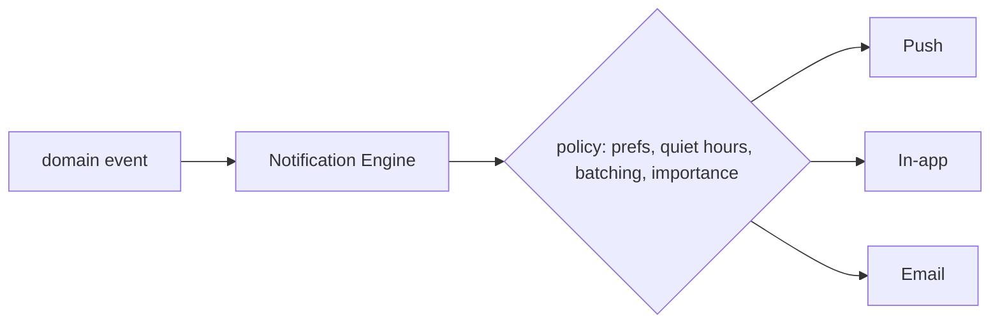

# Notification Template

> Copy this to declare a **notification**. A Skill declares the *intent* to notify; the Notification Engine decides channel, templating, batching, quiet hours, and delivery. Skills never call push/email providers directly.

References: [02 §15](../docs/02_LifeOS_Platform_Architecture.md) · [04 §6](../docs/04_LifeOS_Product_Specification.md)

## Declaration stub

```ts
import { NotificationDeclaration } from '@lifeos/contracts';

export const orderOutForDelivery: NotificationDeclaration = {
  key: '<skill>.order_out_for_delivery',
  on: '<skill>.order_dispatched',          // triggered by a domain event
  requiredCapability: '<skill>.read',
  importance: 'normal',                     // low | normal | high (affects batching/quiet-hours)
  channels: ['push', 'in_app'],             // engine picks per user prefs/availability
  template: {                               // localized; data-driven, no inline strings
    titleKey: '<skill>.notif.order_dispatched.title',
    bodyKey: '<skill>.notif.order_dispatched.body',
  },
  dedupeKey: (e) => `order:${e.payload.orderId}`,
  deepLink: (e) => orderLink(e.payload.orderId),
};
```

## Delivery flow



## Rules checklist

- [ ] Skill **declares**; engine **delivers** — no direct provider/channel calls in the Skill.
- [ ] Triggered by a **domain event** (idempotent; dedupe key set).
- [ ] **Capability-gated**; respects user prefs, quiet hours, and batching.
- [ ] Templates are **localized keys**, not inline strings ([03 §6 no hardcoding](../docs/03_LifeOS_Engineering_Handbook.md)).
- [ ] `importance` set appropriately; high-importance bypasses batching only when justified.
- [ ] No sensitive data in payloads/titles.

## Tests

- [ ] Unit: declaration → engine selects expected channels for given prefs.
- [ ] Quiet-hours / batching / dedupe behavior.
- [ ] Integration: event → notification queued → delivered (mock channel).

## Definition of Done

- [ ] Notification delivers on its event through the engine, honoring prefs/quiet hours.
- [ ] Idempotent; no duplicates on event replay.
- [ ] Tests green; docs + [06 PROJECT_STATE](../docs/06_PROJECT_STATE.md) updated.

## Future extension points

- Additional channels (SMS, WhatsApp, wearables); smart bundling; send-time optimization.
