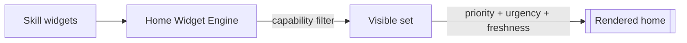

# Widget Template (Home Contribution)

> Copy this for a **home widget** a Skill contributes. The home screen is assembled dynamically from widget contributions — nothing is hardcoded. A widget is a read-only summary that deep-links into a conversation turn.

References: [02 §15](../docs/02_LifeOS_Platform_Architecture.md) · [04 §4 Home](../docs/04_LifeOS_Product_Specification.md)

## Contribution stub

```ts
import { WidgetContribution } from '@lifeos/contracts';

export const lowStockWidget: WidgetContribution = {
  key: '<skill>.low_stock',
  requiredCapability: '<skill>.read',     // capability-gated visibility
  priorityHint: 'urgency',                // how the engine ranks it
  freshness: { ttlSeconds: 300 },         // when to recompute
  // builds from the read model, NOT by querying write tables directly
  async build(ctx): Promise<WidgetView> {
    const data = await ctx.readModel('<skill>.low_stock', ctx.user.id);
    return {
      title: 'Running low',
      items: data.items.map(i => ({ label: i.name })),
      action: { label: 'Reorder', deepLink: prefilledTurn('Reorder the usual') },
    };
  },
};
```

## Home assembly (how it's ranked)



## Rules checklist

- [ ] **Read-only**: builds from a CQRS read model / Unified Context, never mutates and never queries write tables ad hoc ([ADR-0007](../docs/adr/adr-0007-context-engine.md), [ADR-0008](../docs/adr/adr-0008-event-driven-outbox.md)).
- [ ] **Capability-gated** visibility; hidden if the user lacks the capability.
- [ ] No hardcoded layout/order — provides `priorityHint`/`freshness`, the engine decides.
- [ ] Actions are **deep links** into conversation turns, not bespoke logic.
- [ ] Degrades gracefully (empty/stale state) without breaking the home.

## Tests

- [ ] Unit: `build()` from a fabricated read model/context.
- [ ] Capability test: hidden when capability absent.
- [ ] Snapshot of `WidgetView` shape.

## Definition of Done

- [ ] Widget appears when its Skill is enabled and capability held; vanishes otherwise.
- [ ] No core change required to surface it (registered via manifest).
- [ ] Tests green; docs + [06 PROJECT_STATE](../docs/06_PROJECT_STATE.md) updated.

## Future extension points

- User-customizable home ordering; A/B priority policies; richer widget types.
