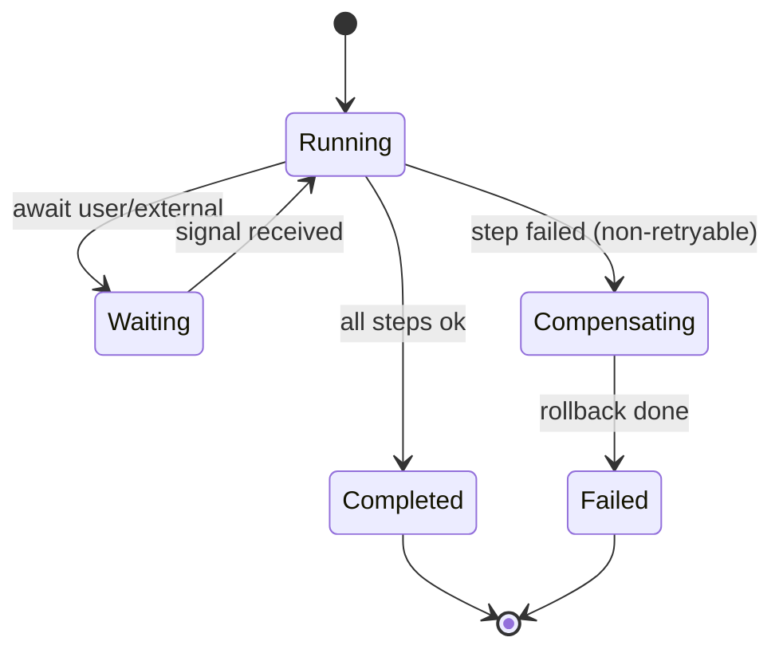

# Workflow Template

> Copy this to define a multi-step, durable, resumable **workflow** executed by the Workflow Engine. Use a workflow when an Execution Plan has steps that are long-running, retryable, ordered with dependencies, or must survive process restarts.

References: [02 §5/§6](../docs/02_LifeOS_Platform_Architecture.md) · [ADR-0008](../docs/adr/adr-0008-event-driven-outbox.md)

## When to use a workflow vs a single tool call

| Use a workflow | Use a plain tool |
|----------------|------------------|
| Multiple ordered steps with dependencies | Single atomic action |
| Long-running / external waits | Fast, synchronous |
| Needs retries / idempotency / resume | One-shot |
| Compensation/rollback on failure | No rollback needed |

## Structure

```ts
import { defineWorkflow, step } from '@lifeos/platform-core';

export const restockGroceriesWorkflow = defineWorkflow({
  name: '<skill>.restock_groceries',
  steps: [
    step('search', { tool: '<skill>.search_products', retry: { max: 3 } }),
    step('build_cart', { tool: '<skill>.build_cart', dependsOn: ['search'] }),
    step('confirm', { type: 'await_user_confirmation', dependsOn: ['build_cart'] }),
    step('place_order', {
      tool: '<skill>.place_order',
      dependsOn: ['confirm'],
      idempotent: true,
      compensate: '<skill>.cancel_order',   // rollback on later failure
    }),
  ],
  onComplete: emit('<skill>.restock_completed'),
});
```

## State diagram



## Rules checklist

- [ ] Every step that mutates external state is **idempotent** or has a **compensation**.
- [ ] Steps call **tools** (never provider APIs or other Skills directly).
- [ ] Long waits use `await_*` steps, not blocking.
- [ ] Emits domain events via the **outbox** on completion/failure.
- [ ] Resumable after restart (state persisted, not in memory).

## Tests

- [ ] Unit: step ordering & dependency resolution.
- [ ] Integration: retry, compensation/rollback, resume-after-crash.
- [ ] Idempotency: replaying a step produces no duplicate effects.

## Definition of Done

- [ ] Workflow runs end-to-end, survives a worker restart mid-run.
- [ ] Failure triggers compensation; events emitted correctly.
- [ ] Tests green; docs + [06 PROJECT_STATE](../docs/06_PROJECT_STATE.md) updated.

## Future extension points

- Visual workflow inspector in the Dev Console.
- Human-in-the-loop approval steps; scheduled/delayed steps.
